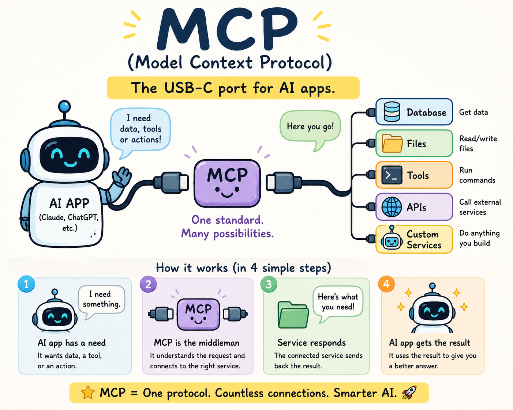
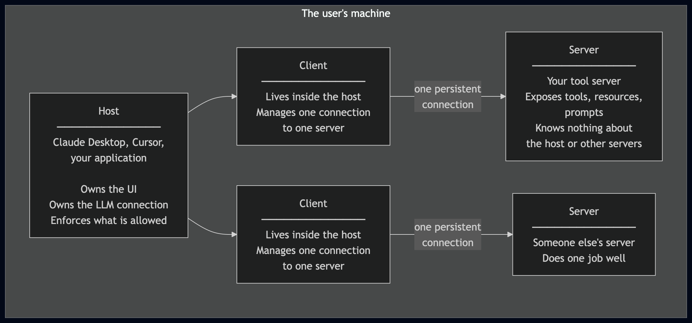
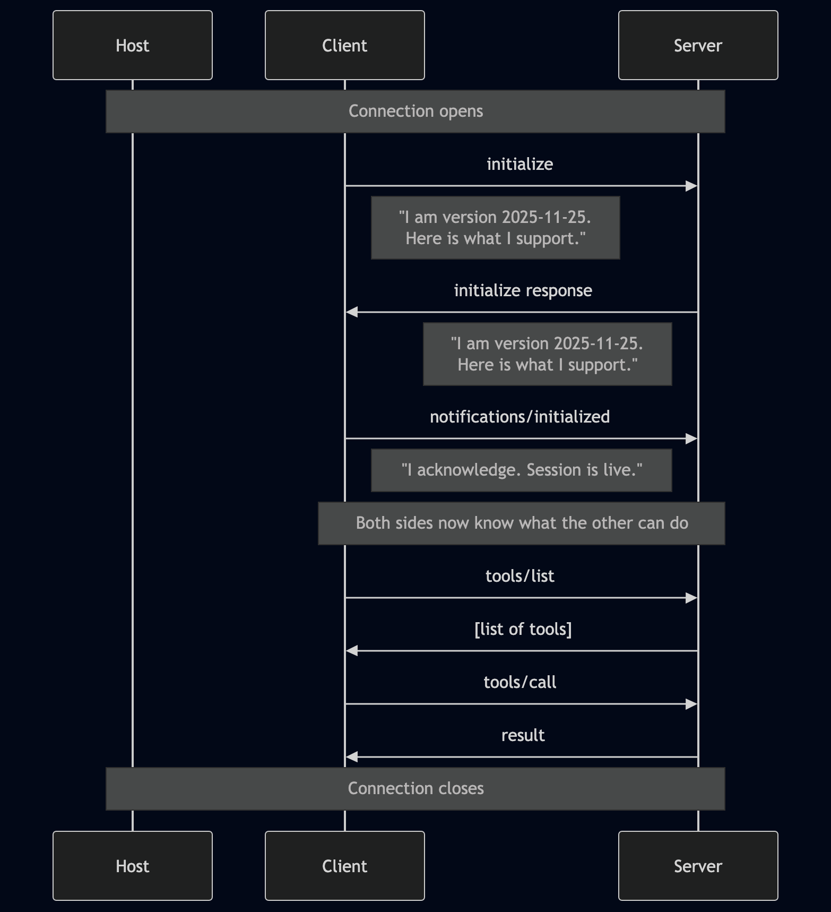

# 01 What is MCP?

**The question this module answers:** why does MCP exist, and what problem does it solve so precisely that a standard was worth creating?

No code in this module. Read it carefully. Every module after this one builds on the mental model you form here.

---

## Start here: a problem you have already hit

You are building something with an AI model. The model is good at reasoning but it is trapped. It only knows what you put in the prompt. It cannot check today's weather, read a file on your disk, query your database, or call your API. It can only work with text you give it.

The obvious fix is to give the model tools. You write a `getWeather()` function, describe it with a schema, and expose it to the model. When the user asks about the weather, the model decides to call it - your application runs the function and sends the result back into the conversation. It works. You add a `readFile()` tool. Then `queryDatabase()`. Then `callAPI()`.

Now you have a new problem: every AI application you build does this differently. Your weather app wires up functions one way. Your coding assistant wires them up another way. If you want to share the database tool between both applications, you copy and paste code. When the tool changes, you update it in two places. When a third application needs it, you do it again.

This is the problem MCP solves.

---

## What MCP actually is

MCP - the Model Context Protocol - is a standard that defines exactly how an AI application and the program that provides its tools talk to each other.

When you first connect tools to an LLM, both sides often live in the same application: the model requests a call, your code runs the function, the result goes back. MCP does not change that loop. It standardizes the conversation when the tool code runs as a separate program - what MCP calls a **server** - that a chat app (the **host**) connects to over a fixed protocol.

The key word is **standard**. Before MCP, every AI application invented its own way to wire up tools. After MCP, there is one way.

Take your `getWeather()` tool. In your chat script it works because you wired it in - schema, handler, result back to the model. That wiring belongs to your script. Cursor expects a different shape. Claude Desktop another. The function itself is fine to reuse; the glue around it is not. You rewrite or copy-paste the integration for every new app.

MCP standardizes the glue. You put `getWeather()` in an MCP server - a small standalone program. Claude Desktop, Cursor, your own application, or any other MCP-compatible host connects to that server over the same protocol. The server does not change per app; each host only needs to speak MCP.

It was created by Anthropic and released as an open standard in November 2024.

---

## The analogy that actually holds up

Think about USB.

Before USB, every peripheral used a different connector. A printer used one port, a keyboard another, a mouse another. Device manufacturers had to decide which ports to support. Computer manufacturers had to decide which ports to include. Everything was negotiated device by device.

USB created a single standard connector. A device that speaks USB works with any computer that speaks USB. The device manufacturer and the computer manufacturer no longer need to know anything about each other beyond the standard.

MCP is USB for AI tools.

An MCP server works with any AI application that speaks MCP. You write the tools once. Every compliant host can use them.

Official SDKs exist for TypeScript, Python, C#, Kotlin, and other major languages, so MCP fits into normal app development on either side - you do not have to hand-roll the protocol to ship a host or a server.

---

## The three actors

Every MCP system has exactly three kinds of participant. Understanding who they are and what they are responsible for is the most important thing in this module.



**The Host** is the application the user runs. Claude Desktop is a host. It creates and manages clients. It owns the conversation with the user. It decides which servers are allowed to connect. It decides whether a tool call needs user confirmation before it runs. The host is in charge.

**The Client** lives inside the host. One client per server - always. The client manages the connection, handles the protocol, and routes messages between the host and its server. The user never interacts with the client directly. It is infrastructure.

**The Server** is your code. It exposes things the model can use: tools it can call, resources it can read, prompts it can request. The server does not know which host is using it. It does not know what other servers are connected. It does not see the conversation. It only sees the messages the client sends it and responds to them.

This separation is deliberate. The server being isolated from the host is what makes a server reusable across hosts. The server being isolated from other servers is what makes the system composable and safe.

---

## What a server can expose

A server can expose three kinds of thing. You will build all three in this repository, but it helps to understand the distinction before you start.

**Tools** are functions the model can call. A tool takes arguments, does something, and returns a result. Examples: search the web, write a file, send an email, query a database, restart a server, trigger a CI pipeline, or turn off the office lights. Tools can have side effects. They change the world.

**Resources** are data the model can read. A resource has a URI - like a web address - and returns content when fetched. Examples: a file on disk, a database row, a live sensor reading. Resources are read-only by design. They do not change the world.

**Prompts** are reusable templates the **user** selects in the host (slash menu or prompt picker). A prompt takes arguments and returns structured `messages` for the host to send to the model. They are user-controlled - not model-autonomous like tools.

| Primitive | When to use | Who initiates | Protocol |
|-----------|-------------|---------------|----------|
| **Tool** | Act on the world (write, send, compute) | Model via host | `tools/list`, `tools/call` |
| **Resource** | Read context (files, schemas, notes) | Host / model reads | `resources/list`, `resources/read` |
| **Prompt** | Seed a conversation with a template | **User** via host UI | `prompts/list`, `prompts/get` |

The distinction between tools, resources, and prompts matters. If the model needs to act, it uses a tool. If it needs to read, it uses a resource. If the **user** wants a reusable workflow template, the host offers prompts. Keeping them separate is what lets the host apply different security rules to each.

### Prompt vs Tool

Use a **prompt** when the **user** should choose and fill in a reusable template to start a conversation. Use a **tool** when the **model** should decide at runtime to invoke an action and return a result.

Example: a `/review-pr` slash command that asks the model to review a pull request with a fixed structure is a **prompt** - the user picks it from a menu and supplies the PR number. A `merge_pr` function the model calls on its own when the user says "merge it" is a **tool** - the model decides when to act, and the host may ask for confirmation first.

---

## What a session looks like

When a host connects to a server, something specific happens before any tools are called. There is a handshake.



This handshake is not optional. It is the first thing that happens in every MCP session. It exists because the client and server need to agree on the protocol version and on which features each side supports before any work begins. Each side publishes a capabilities list - what it can do (tools, resources, prompts, and so on) - so neither side sends requests the other cannot handle. You will implement this handshake yourself in module 04.

---

## What the messages look like on the wire

MCP messages are plain JSON, sent one per line, over standard input and output between processes. There is nothing exotic here. This walkthrough uses a tool that sends an email - an action with a side effect. Reading a file would be a **resource** (`resources/read`), not a `tools/call`.

A client asking for the list of tools:
```json
{"jsonrpc":"2.0","id":1,"method":"tools/list","params":{}}
```

A server responding with one tool:
```json
{
  "jsonrpc":"2.0",
  "id":1,
  "result":{
    "tools":[{
      "name":"send_email",
      "description":"Send an email to a recipient",
      "inputSchema":{
        "type":"object",
        "properties":{
          "to":{"type":"string","description":"Recipient email address"},
          "subject":{"type":"string","description":"Email subject line"},
          "body":{"type":"string","description":"Email body text"}
        },
        "required":["to","subject","body"]
      }
    }]
  }
}
```

A client calling that tool:
```json
{
  "jsonrpc":"2.0",
  "id":2,
  "method":"tools/call",
  "params":{
    "name":"send_email",
    "arguments":{
      "to":"alice@example.com",
      "subject":"Follow up",
      "body":"Can we meet Monday?"
    }
  }
}
```

A server returning the result:
```json
{
  "jsonrpc":"2.0",
  "id":2,
  "result":{
    "content":[{
      "type":"text",
      "text":"Email sent to alice@example.com"
    }]
  }
}
```

That is it. Four JSON objects and an email has been sent. The next seven modules will teach you exactly what every field in those messages means and why it is shaped that way. But even now you can see that this is not mysterious. It is structured text passing between two processes.

---

## Why this is the right level of abstraction

You might wonder: why a new protocol? Why not just use REST APIs? Or GraphQL? Or function calling directly in the model?

The answer is that MCP is designed for a specific relationship that none of those fit well.

Compared to REST specifically: REST is stateless. MCP sessions are stateful - the server stays alive between calls, which matters for things like keeping a browser open, maintaining a database connection, or streaming a long result.

Function calling built into the model is tied to one model provider. MCP is model-agnostic. The server does not know or care whether it is talking to Claude, GPT-4, or a local model.

Custom protocols per tool mean every tool is a different integration. MCP means every tool is the same integration.

The protocol is also deliberately simple. The messages you saw above are the whole thing. There are no complex schemas to learn, no query languages, no transformation pipelines. Just method calls and responses over a persistent connection.

---

## What you are going to build

Over the next modules you will build a working MCP server from scratch. By module 06 you will connect **tools** to Claude Desktop. Module 09 adds **prompts** (slash commands in Desktop and Cursor). Modules 07–11 deepen the protocol.

Here is what each module teaches, mapped to the concepts in this one:

| Module | Concept from this module |
|---|---|
| 02 | The JSON message format |
| 03 | How two processes communicate via stdin/stdout |
| 04 | The handshake - initialize and initialized |
| 05 | Exposing tools - tools/list |
| 06 | Calling tools - tools/call |
| **★** | **Connect tools to Claude Desktop** |
| 07 | How errors are reported |
| 08 | Resources - read-only data |
| 09 | Prompts - reusable templates (`prompts/list`, `prompts/get`) |
| **★** | **Connect prompts to Desktop / Cursor** |
| 10 | Notifications - server-initiated messages |
| 11 | Sampling - server asks the model to classify input inside a tool |

Every module builds directly on the previous one. Do not skip ahead.

**Building your own agent?** After you can call tools (module 06), see [module 12](../12-mcp-and-agents/README.md) for why MCP fits LLM workflows and how it plugs into a custom agent loop or LangChain.

---

## Before you move on

Make sure you can answer these questions without looking. If you cannot, re-read the relevant section.

1. What is the difference between a host, a client, and a server?
2. What is the difference between a tool, a resource, and a prompt?
3. When would you use a **Prompt** instead of a **Tool**?
4. Why does the handshake happen before any tools are called?
5. Why is MCP a better fit for AI tools than REST?
6. How many clients does a host create per server?

Still struggling? See [ANSWERS.md](./ANSWERS.md).

When you can answer all six, open [../02-json-rpc/README.md](../02-json-rpc/README.md).

---

## Specification reference

This module covers the architecture section of the MCP specification.

[https://modelcontextprotocol.io/specification/2025-11-25/architecture](https://modelcontextprotocol.io/specification/2025-11-25/architecture)