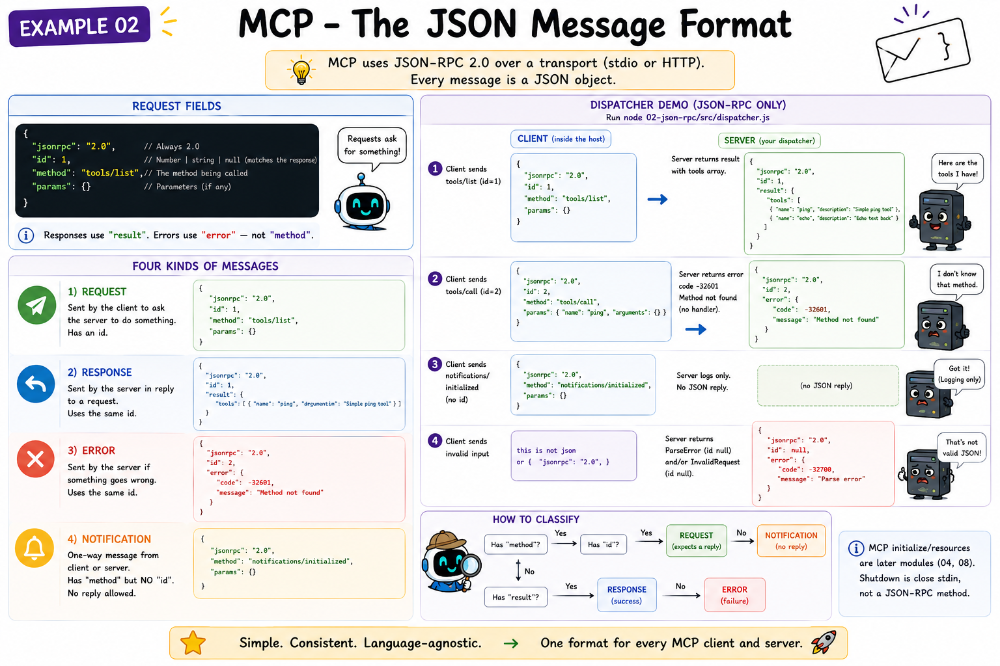
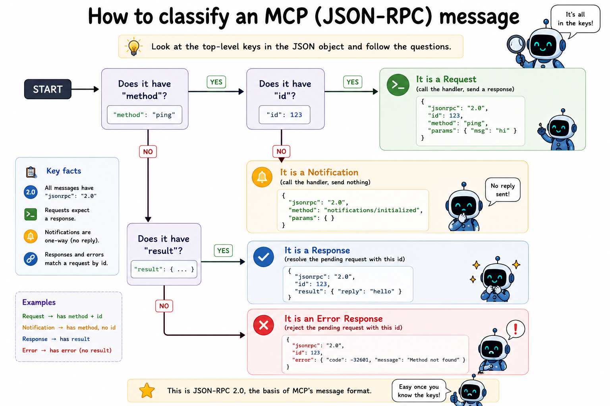

# 02 What is JSON-RPC?

## The question

MCP messages are plain JSON. But plain JSON is just a blob - it does not say anything about who is asking, what they want, or how the receiver should respond. You need a convention on top of JSON that gives every message a shape.

That convention is **JSON-RPC 2.0**.



---

## What JSON-RPC is

JSON-RPC is a minimal remote procedure call protocol. "Remote procedure call" means: I want to call a function that lives in another process, pass it arguments, and get a result back. JSON-RPC defines how you express that as JSON.

The full specification is one short page. Everything MCP needs is already in it.

---

## The four message shapes

### Request

A caller wants to invoke a method and expects a result.

```json
{
  "jsonrpc": "2.0",
  "id": 1,
  "method": "tools/list",
  "params": {}
}
```

Rules:
- `jsonrpc` is always the string `"2.0"`. Non-negotiable.
- `id` identifies this request. The response must carry the same `id`. Can be a number or a string - never `null` for a request.
- `method` is the name of the function to call.
- `params` is the argument payload. Can be an object, an array, or absent entirely.

### Response

The callee handled the request successfully.

```json
{
  "jsonrpc": "2.0",
  "id": 1,
  "result": {
    "tools": []
  }
}
```

Rules:
- `id` must match the request's `id` exactly.
- `result` is the return value. Its shape is defined by the method, not by JSON-RPC.
- A response must contain either `result` or `error` - never both, never neither.

### Error

The callee could not fulfil the request.

```json
{
  "jsonrpc": "2.0",
  "id": 1,
  "error": {
    "code": -32601,
    "message": "Method not found"
  }
}
```

Rules:
- `id` matches the request (or `null` if the request could not be parsed at all).
- `error.code` is an integer. JSON-RPC reserves the range `-32768` to `-32000` for pre-defined codes.
- `error.message` is a short human-readable description.
- `error.data` is optional - any additional context the caller might use.

Pre-defined error codes:

| Code    | Meaning              |
|---------|----------------------|
| -32700  | Parse error          |
| -32600  | Invalid request      |
| -32601  | Method not found     |
| -32602  | Invalid params       |
| -32603  | Internal error       |

### Notification

A sender wants to inform the receiver about something. No response is expected or allowed.

```json
{
  "jsonrpc": "2.0",
  "method": "notifications/initialized",
  "params": {}
}
```

Rules:
- No `id` field. This is what distinguishes a notification from a request.
- The receiver must not send a response. If it does, the sender must ignore it.

---

## How to tell messages apart when reading

When a message arrives, you can classify it with the following checks:



This logic lives in [src/jsonrpc.js](./src/jsonrpc.js).

---

## The `id` is a contract

When you send a request with `id: 7`, you are promising: "I will wait for a message that carries `id: 7` back. That message is my answer."

The receiver promises: "Whatever I send back for this message, it will carry `id: 7`."

If either side breaks this contract, the other side will hang forever or match the wrong response to the wrong request. The dispatcher in [src/dispatcher.js](./src/dispatcher.js) enforces the contract on the server side.

---

## Batch requests

JSON-RPC 2.0 allows sending multiple requests as a JSON array in one message. MCP does **not** use batching. Every MCP message is a single JSON object. You do not need to handle arrays.

---

## What the two source files do

**[src/jsonrpc.js](./src/jsonrpc.js)** - Pure encoding and decoding. No I/O, no state. Given data, produce a JSON string. Given a JSON string, produce a classified message object. This is the layer everything else builds on.

**[src/dispatcher.js](./src/dispatcher.js)** - Stateful routing. You register handlers for method names. When a message arrives, the dispatcher classifies it, calls the right handler, and - for requests - formats the handler's return value as a proper response (or catches exceptions and formats them as errors).

Run both: see [run.md](./run.md).

---

## Spec references

- JSON-RPC 2.0 specification: [https://www.jsonrpc.org/specification](https://www.jsonrpc.org/specification)
- MCP base protocol messages: [https://modelcontextprotocol.io/specification/2025-11-25/basic/messages](https://modelcontextprotocol.io/specification/2025-11-25/basic/messages)

---

**Next:** [03-stdio-transport/README.md](../03-stdio-transport/README.md) - How do two processes actually exchange these messages over stdin and stdout?
