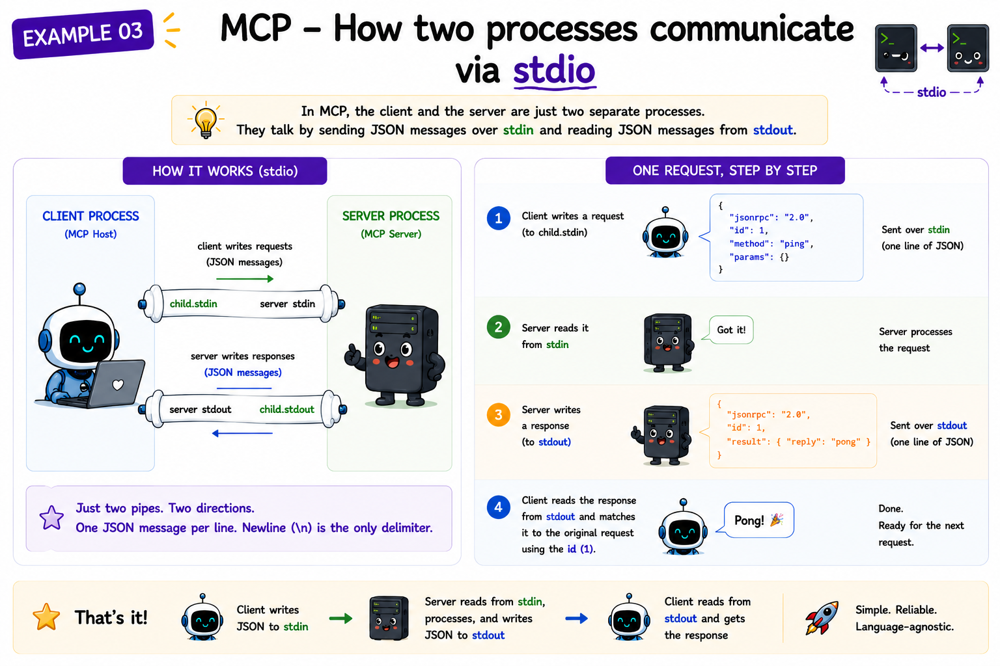

# 03 One way MCP transports messages: stdio

## The question

We now have JSON-RPC messages we can encode and decode. But messages need a transport - a physical channel that carries bytes from one process to another. MCP's default transport is **stdio**: the client writes to the server's stdin; the server writes to its own stdout.

How does that work in Node.js, and what problems does it introduce?

---

## Prerequisites

- Node.js 20 or later
- Run commands from the project root (`mcp-from-scratch/`)
- Module 02 must be present (this module imports [`jsonrpc.js`](../02-json-rpc/src/jsonrpc.js) and [`dispatcher.js`](../02-json-rpc/src/dispatcher.js))

---

## The whole module in four steps

Before any files or APIs, the transport story is this:

**Step 1 - Client writes a request line to the server's stdin**

```
{"id":1,"method":"ping"}
```

**Step 2 - Server reads from stdin**

Bytes arrive in chunks. The server buffers until it has one complete line.

**Step 3 - Server writes a response line to stdout**

```
{"id":1,"result":{"reply":"pong"}}
```

**Step 4 - Client matches the response by `id`**

The client sent `id: 1`. Whatever line comes back with `id: 1` is the answer to that request.

That is the entire module. Everything else in this folder implements those four steps in Node.js.

On the real wire, messages are full JSON-RPC 2.0 (from module 02). The story above is the mental model; the table below is what the code actually sends:

| Step | Story | Actual bytes (code) |
|------|-------|---------------------|
| 1 | Client writes ping | `encodeRequest(1, 'ping', {})` → `{"jsonrpc":"2.0","id":1,"method":"ping","params":{}}\n` |
| 2 | Server reads stdin | `createFramer(process.stdin, …)` |
| 3 | Server writes stdout | `{"jsonrpc":"2.0","id":1,"result":{"reply":"pong"}}\n` |
| 4 | Client matches by `id` | `pending.get(msg.id)` |

Run `node 03-stdio-transport/src/client.js` from the project root to see it end to end.

---

## Why stdio?

A process's stdin and stdout are streams. Any parent process can:

1. Spawn a child process.
2. Write bytes to the child's stdin pipe.
3. Read bytes from the child's stdout pipe.

No TCP socket. No port number. No firewall. The operating system owns the pipe; the host owns the child process. If the host dies, the pipe closes, the server sees EOF on stdin, and exits. Clean, composable, secure.

The alternative transport - HTTP + SSE - exists for remote servers. Modules 01–06 use stdio exclusively because it eliminates all networking from the learning path.

---

## The framing problem

Streams deliver bytes - not messages. `process.stdin` emits `data` events as chunks arrive, and those chunks have no guaranteed relationship to your JSON messages. A single `data` event might contain:

- Less than one message (partial line).
- Exactly one message.
- Multiple messages plus part of another.

MCP solves this with the simplest possible delimiter: **one JSON object per line, separated by `\n`**. No length prefix. No envelope. Just newline-delimited JSON.

That means the transport layer must buffer incoming bytes, scan for `\n`, and only forward complete lines to the JSON-RPC layer. This is exactly what [src/framing.js](./src/framing.js) does.

---

## What buffering looks like

Suppose the server receives two `data` events:

```
Event 1: '{"jsonrpc":"2.0","id":1,"method":"ping"'
Event 2: ',"params":{}}\n{"jsonrpc":"2.0","id":2,"method":"ping","params":{}}\n'
```

A naïve `JSON.parse` on event 1 would throw. The framer accumulates both chunks into a string buffer, splits on `\n`, and emits two complete lines:

```
Line 1: '{"jsonrpc":"2.0","id":1,"method":"ping","params":{}}'
Line 2: '{"jsonrpc":"2.0","id":2,"method":"ping","params":{}}'
```

Each line goes to `decode()` in [`02-json-rpc/src/jsonrpc.js`](../02-json-rpc/src/jsonrpc.js). The transport never calls `JSON.parse` directly.

---

## What each file does

**[src/framing.js](./src/framing.js)** - Step 2's hard part. `createFramer(readable, onLine)` attaches to any Node.js Readable stream, buffers chunks until a `\n` arrives, and calls `onLine` once per complete message line.

**[src/server.js](./src/server.js)** - Steps 2 and 3. A framer on `process.stdin` feeds lines into the module 02 `Dispatcher`; the dispatcher's output goes to `process.stdout.write`. One handler: `ping` → `{ reply: 'pong' }`.

**[src/client.js](./src/client.js)** - Steps 1 and 4. Spawns [src/server.js](./src/server.js), writes one `ping` request to the child's stdin, reads the response from the child's stdout via a framer, resolves a Promise when `id` matches, then closes the pipe so the server exits.

Run it: see [run.md](./run.md).

---

## The stdout buffering trap

`process.stdout` in Node.js is line-buffered when connected to a terminal, but when connected to a pipe (as it is when the server is spawned by the client), it is **fully buffered** by default. This means output may not flush immediately.

To avoid hangs, always call `process.stdout.write(line)` directly - never `console.log` inside a server - because `console.log` adds its own newline and may buffer. The server in this module writes directly to `process.stdout`.

---

## What stdin EOF means

When the client closes its end of the pipe (by calling `child.stdin.end()`), the server sees an `end` event on `process.stdin`. This is the signal to exit. A well-behaved MCP server exits cleanly on stdin EOF. Module 04 adds a formal **initialize / ready** handshake before normal traffic, but process shutdown in this teaching repo still relies on stdin EOF.

---

## Spec references

- Transports overview: [https://modelcontextprotocol.io/specification/2025-11-25/basic/transports](https://modelcontextprotocol.io/specification/2025-11-25/basic/transports)
- stdio transport: [https://modelcontextprotocol.io/specification/2025-11-25/basic/transports#stdio](https://modelcontextprotocol.io/specification/2025-11-25/basic/transports#stdio)

---

**Next:** [04-lifecycle/README.md](../04-lifecycle/README.md) - How does a session actually start? What is the `initialize` handshake and why does it exist?
