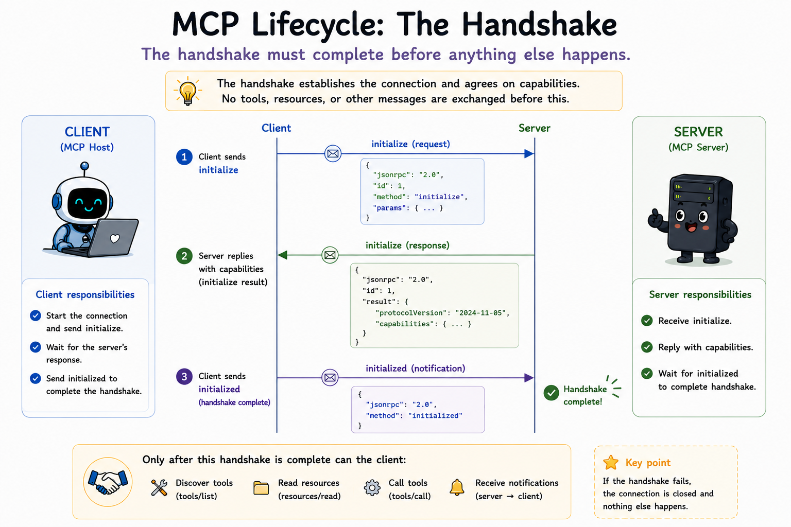
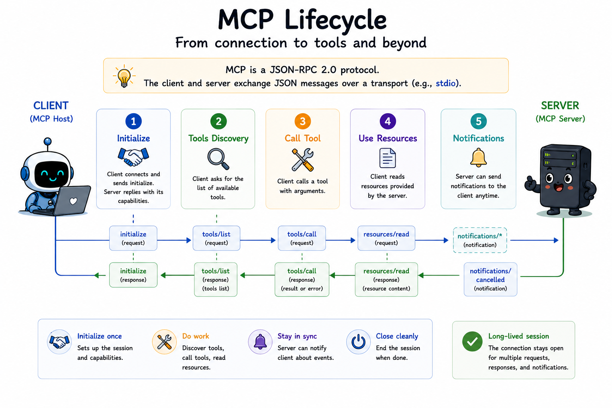

# 04 How does a session actually start?

## The question

Module 03 gave us a working transport: two processes exchanging JSON-RPC messages over stdin and stdout. But opening a pipe is not the same as starting an MCP session. If the client immediately sent `tools/list`, should the server answer? What version of the protocol are we speaking? What features does each side support?

MCP answers these questions with a **lifecycle handshake** that must complete before anything else happens.

---

## Prerequisites

- Node.js 20 or later
- Run commands from the project root (`mcp-from-scratch/`)
- Modules 02–03 must be present

---

## Why a handshake exists

USB devices do not start sending data the moment you plug them in. They enumerate first: identify themselves, negotiate speed, declare capabilities. MCP does the same thing at the protocol layer.

The handshake serves three purposes:

1. **Protocol version negotiation** - Both sides agree on which revision of the spec they will follow. If they cannot agree, the connection should not proceed.
2. **Capability discovery** - Each side declares what primitives it supports (tools, resources, prompts, sampling, and so on). This avoids sending requests the other side cannot handle.
3. **Identity exchange** - `clientInfo` and `serverInfo` carry name and version strings for logging and debugging.

Until the handshake finishes, the session is not **ready**. The server must reject normal requests. The client must not send them.

This module accepts protocol versions `2025-11-25` and `2025-06-18`; later examples keep using `2025-11-25`.

---

## The three messages

### 1. Client sends `initialize` (request)

```json
{
  "jsonrpc": "2.0",
  "id": 1,
  "method": "initialize",
  "params": {
    "protocolVersion": "2025-11-25",
    "capabilities": {},
    "clientInfo": {
      "name": "example-client",
      "version": "1.0.0"
    }
  }
}
```

### 2. Server responds with its capabilities (response)

```json
{
  "jsonrpc": "2.0",
  "id": 1,
  "result": {
    "protocolVersion": "2025-11-25",
    "capabilities": {
      "tools": { "listChanged": true }
    },
    "serverInfo": {
      "name": "example-server",
      "version": "1.0.0"
    }
  }
}
```

### 3. Client sends `notifications/initialized` (notification)

```json
{
  "jsonrpc": "2.0",
  "method": "notifications/initialized"
}
```

No `id` field - this is a notification. The server must not send a response.

Only after step 3 may the client send `tools/list`, `tools/call`, and other normal requests. Only after step 3 should the server treat the session as fully operational.

---

## The state machine

[src/session.js](./src/session.js) tracks four states:

| State | Meaning |
|-------|---------|
| `CREATED` | Connection open. Handshake not started. |
| `INITIALIZING` | `initialize` exchanged. Waiting for `notifications/initialized`. |
| `READY` | Handshake complete. Normal operation. |
| `CLOSED` | Session ended. |

Server-side transitions:

```
CREATED  --initialize request-->  INITIALIZING  --notifications/initialized-->  READY
```

Client-side transitions:

```
CREATED  --send initialize-->  INITIALIZING  --send notifications/initialized-->  READY
```

The server rejects requests like `echo` or `tools/list` while in `CREATED` or `INITIALIZING`. The client in this module refuses to send them until it reaches `READY`.

---

## What each file does

**[src/session.js](./src/session.js)** - The state machine. Exports `Session`, `SessionState`, protocol version constants, and `negotiateProtocolVersion()`. Both server and client import it so the rules live in one place.

**[src/server.js](./src/server.js)** - A real MCP server skeleton. Before forwarding a line to the dispatcher, it decodes the message and checks `session.canAcceptRequest()` or `session.canAcceptNotification()`. Registers handlers for `initialize`, `notifications/initialized`, and demo methods `ping` and `echo`.

**[src/client.js](./src/client.js)** - Spawns the server, runs the handshake, demonstrates that a premature `echo` is rejected, then calls `ping` and `echo` after the session is ready.

Run it: see [run.md](./run.md).

---

## Ping during initialization

The spec allows `ping` during the initialization phase on both sides. Our server permits `ping` in every state except `CLOSED`. Everything else waits for `READY`.

---

## Full lifecycle



The diagram shows the entire MCP session from first byte to last. This module implements phase 1. The later modules fill in the rest.

### Phase 1 - Initialize (this module)

The client sends `initialize`. The server replies with its capabilities and `serverInfo`. The client acknowledges with `notifications/initialized`. Nothing else may happen until these three messages have been exchanged in order.

This is the handshake you have been reading about. After it completes, `session.state` is `READY` on both sides.

### Phase 2 - Tools discovery (module 05)

Once the session is READY the client sends `tools/list`. The server returns an array of tool definitions - name, description, and JSON Schema for each parameter. The client now knows what it can call.

Discovery is a request/response pair like any other JSON-RPC call. It can be repeated at any time; the server advertises `tools.listChanged: true` in its capabilities so the client knows to re-fetch when the list changes.

### Phase 3 - Call tool (module 06)

The client sends `tools/call` with the tool name and its arguments. The server executes the tool and returns the result (or an `isError: true` payload when the tool itself fails, which is different from a JSON-RPC error).

`tools/call` is the core of every MCP-powered AI workflow. Steps 2 and 3 repeat in a loop for as long as the AI model needs to use tools.

### Phase 4 - Use resources (module 08)

Resources are read-only data the server exposes - files, database rows, API responses, anything the client might want to attach to a prompt. The client sends `resources/list` to discover them and `resources/read` to fetch their content.

Resources are separate from tools because they are passive: reading a resource does not trigger side effects. Tools cause things to happen; resources just return data.

### Phase 5 - Prompts (module 09)

**Prompts** are reusable templates the **user** selects in the host (slash menu or prompt picker). The client sends `prompts/list` to discover them and `prompts/get` with arguments to fetch structured `messages` for the chat. Unlike tools, the model does not autonomously call prompts. See module 09.

### Phase 6 - Notifications (module 10)

The arrows in the diagram flip direction here. Unlike every other exchange, notifications flow from **server to client** without the client asking first.

The server may send a notification at any point after the session is READY. Common examples: `notifications/tools/list_changed` (the tool list has changed, please re-fetch), `notifications/resources/updated` (a specific resource has new content). The client does not reply - notifications have no `id` and expect no response.

---

## Spec references

- Lifecycle: [https://modelcontextprotocol.io/specification/2025-11-25/basic/lifecycle](https://modelcontextprotocol.io/specification/2025-11-25/basic/lifecycle)

---

**Next:** [05-tools-list/README.md](../05-tools-list/README.md) - How does a client discover what tools a server exposes?
