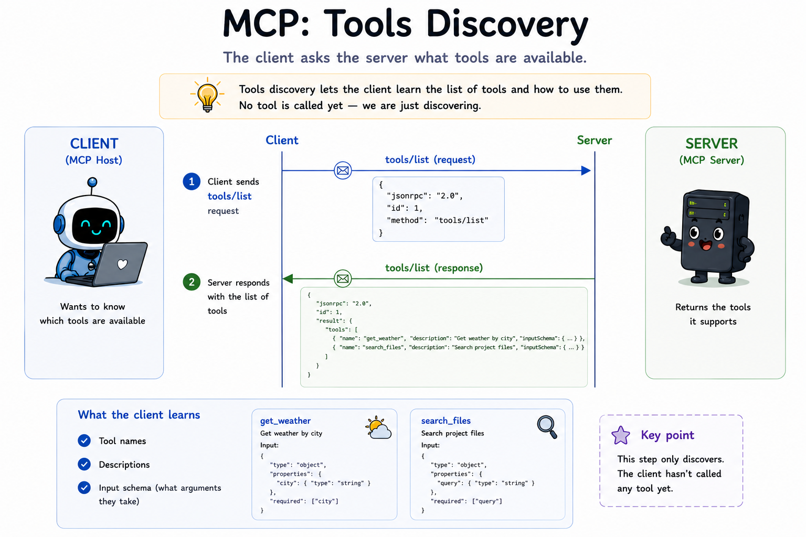

# 05 How does a client discover what tools a server exposes?

## The question

Module 04 gave us a working session: initialize, capabilities, `notifications/initialized`, then normal traffic. The client is **ready** - but ready to do what?

Before a model can call a tool, it needs to know what tools exist, what each one does, and what arguments it accepts. MCP answers that with **`tools/list`**.

---

## Discovery vs invocation

Tools have two distinct protocol operations:

| Method | Purpose | This module |
|--------|---------|-------------|
| `tools/list` | Return tool **definitions** (name, description, `inputSchema`) | Yes |
| `tools/call` | Run a tool with arguments and return a **result** | Module 06 |

Listing is read-only. It does not execute anything. The server publishes a catalogue; the client (or model) chooses from it later.

---

## What a tool definition looks like

Each entry in the `tools` array is a **Tool** object:

```json
{
  "name": "echo",
  "title": "Echo",
  "description": "Returns the message you send, unchanged.",
  "inputSchema": {
    "type": "object",
    "properties": {
      "message": {
        "type": "string",
        "description": "Text to echo back"
      }
    },
    "required": ["message"]
  }
}
```

Important fields:

- **`name`** - unique identifier. Used again in `tools/call` (module 06).
- **`description`** - human-readable text for the model.
- **`inputSchema`** - JSON Schema describing arguments. Must be a valid schema object with `type: "object"`. For tools with no parameters, use `{ "type": "object", "additionalProperties": false }`.

Optional fields like `title`, `outputSchema`, and `annotations` exist in the full spec. This module keeps definitions small so the wire format stays easy to read.

---

## Designing tools the model can choose

`tools/list` is how the model learns what exists. The host sends each tool's `name`, `description`, and `inputSchema` to the model. Vague or overlapping entries cause wrong or missing tool calls - even when your protocol code is perfect.

### Naming (`name`)

- Use **stable, unique** identifiers: `snake_case` or dotted segments (matches [`registry.js`](./src/registry.js)).
- Prefer **verb + object**: `read_file`, `search_issues` - not `helper` or `process`.
- Avoid **generic names** that collide when hosts merge tool lists from many servers: `search`, `run`, `get`, `handle`.
- **One job per tool** - if the model must guess parameters to pick behavior, split into multiple tools.

### Descriptions (`description`)

- State **what it does**, **when to use it**, and optionally **when not to** (e.g. “Use for issue tickets, not for file search”).
- Do not use the tool `name` alone as the description.
- Put parameter-specific rules in **`inputSchema.properties.*.description`**, not only in the top-level description.

### Schemas (`inputSchema`)

- Every property needs a `description` - models rely on them as much as types.
- Mark `required` honestly; use `enum` when values are fixed.
- For no-arg tools, use `{ "type": "object", "additionalProperties": false }`.

### Ambiguity between tools

Two tools with overlapping descriptions → the model picks the wrong one or alternates. Fix by narrowing descriptions, renaming for contrast (`search_docs` vs `search_code`), or merging into one tool with a `scope` enum.

### Weak vs stronger definitions

| Weak | Stronger |
|------|----------|
| `name: "search"`, `description: "Searches."` | `name: "search_issues"`, `description: "Search the issue tracker by keyword. Use when the user asks about tickets or bugs, not for file search."` |
| `message` with no property description | `message`: `"Exact string to echo back to the user."` |

When tools fail in a real host, see module 06 **When tools fail in practice** and module 12 (schemas copy verbatim into the agent loop).

---

## The request and response

After the lifecycle handshake completes, the client sends:

```json
{
  "jsonrpc": "2.0",
  "id": 2,
  "method": "tools/list",
  "params": {}
}
```

The server responds:

```json
{
  "jsonrpc": "2.0",
  "id": 2,
  "result": {
    "tools": [
      { "name": "echo", "description": "...", "inputSchema": { } },
      { "name": "get_time", "description": "...", "inputSchema": { } }
    ]
  }
}
```

The spec also supports **pagination** via an optional `cursor` in `params` and `nextCursor` in the result. Our teaching server returns every tool in one page - enough for learning. Add pagination when your catalogue grows.

---

## Server capabilities

Servers that expose tools declare the `tools` capability during `initialize`:

```json
{
  "capabilities": {
    "tools": {
      "listChanged": true
    }
  }
}
```

`listChanged: true` means the server may send `notifications/tools/list_changed` when tools are added or removed (module 10). The client learns that discovery might need to be repeated.

---

## What each file does

**[src/registry.js](./src/registry.js)** - In-memory store for tool definitions. `register()` validates each tool; `list()` returns all definitions sorted by name. No I/O, no JSON-RPC - pure data.

**[src/server.js](./src/server.js)** - Same lifecycle gate as module 04, plus a `tools/list` handler that reads from the registry. Three demo tools are registered at startup: `echo`, `get_time`, and `add`.

**[src/client.js](./src/client.js)** - Runs the handshake, proves `tools/list` is rejected before initialize, then calls `tools/list` and prints each tool's name, description, and parameters.

Run it: see [run.md](./run.md).

---

## Definitions live separately from handlers

Notice that [src/registry.js](./src/registry.js) stores schemas only. The server does not run `echo` or `add` yet - it only advertises them. That separation matters:

1. **Discovery is cheap** - list once, cache, refresh when `list_changed` fires.
2. **Schemas are the contract** - clients and models plan calls from `inputSchema` before any code runs.
3. **Module 06 wires execution** - `tools/call` looks up the name and invokes the real function.

---

## Spec references

- Tools: [https://modelcontextprotocol.io/specification/2025-11-25/server/tools](https://modelcontextprotocol.io/specification/2025-11-25/server/tools)
- Lifecycle (must complete before `tools/list`): [https://modelcontextprotocol.io/specification/2025-11-25/basic/lifecycle](https://modelcontextprotocol.io/specification/2025-11-25/basic/lifecycle)

---

**Next:** [06-tools-call/README.md](../06-tools-call/README.md) - How does a client actually invoke a tool?
