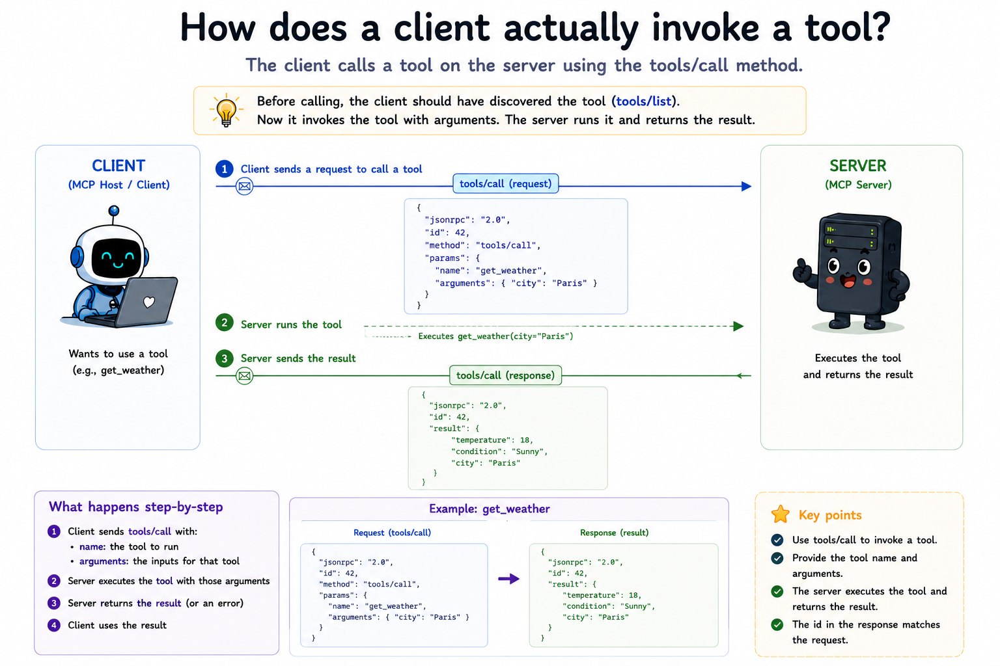

# 06 How does a client actually invoke a tool?

## The question

Module 05 answered discovery: the client knows which tools exist and what arguments each one accepts. The next step is **execution** - send arguments, run the server-side function, and return a result the model can read.

MCP does that with **`tools/call`**.

---

## Discovery vs invocation (again)

| Method | Purpose | Module |
|--------|---------|--------|
| `tools/list` | Return tool **definitions** | 05 |
| `tools/call` | Run a tool and return a **result** | This module |

Listing tells the model what is possible. Calling makes something happen.

---

## Connect and debug

Module 06 is the milestone: your server can be driven by a real MCP client, not only the teaching [client.js](./src/client.js).

Pick one path:

### Path A: Local only (no Claude Desktop)

Open **[`run-local.md`](./run-local.md)** - full checklist, no scrolling between sections.

Optional Inspector: [`src/inspector.md`](./src/inspector.md).

### Path B: Claude Desktop

Open **[`run-desktop.md`](./run-desktop.md)** - full checklist, no scrolling between sections.

Optional Inspector: [`src/inspector.md`](./src/inspector.md). Then [`connect.md`](./src/connect.md) + [macOS](./src/connect-macos.md) · [Windows](./src/connect-windows.md) · [Linux](./src/connect-linux.md).

Not sure which path? Start at [`run.md`](./run.md).

---

## The request and response

After the lifecycle handshake, the client sends:

```json
{
  "jsonrpc": "2.0",
  "id": 3,
  "method": "tools/call",
  "params": {
    "name": "echo",
    "arguments": {
      "message": "hello from MCP"
    }
  }
}
```

- **`name`** - must match a tool from `tools/list`.
- **`arguments`** - object matching that tool's `inputSchema`. Omit or use `{}` when the schema has no properties.

The server responds with a **CallToolResult**:

```json
{
  "jsonrpc": "2.0",
  "id": 3,
  "result": {
    "content": [
      {
        "type": "text",
        "text": "hello from MCP"
      }
    ],
    "isError": false
  }
}
```

### The `content` array

Tool results are not a single string. They are an array of **content blocks**, each with a `type`:

| Type | Use |
|------|-----|
| `text` | Plain text for the model |
| `image` | Base64 image data |
| `audio` | Base64 audio data |
| `resource` | Embedded resource payload |
| `resource_link` | URI the client can fetch later |

This module returns only `text` blocks - enough for real tools and for Claude Desktop. Richer types appear in later modules and in the full spec.

### `isError`

When `isError` is `true`, the call succeeded at the protocol level but the **tool** failed (bad input, API down, business rule violated). The model can read the text and retry with different arguments.

**Protocol errors** (unknown tool, malformed params) are different: they come back as JSON-RPC `error` objects, not as `isError` results. Module 07 explores both paths in detail.

---

## When tools fail in practice

The protocol can work perfectly while the **model ignores or misuses** your tools. Symptoms and fixes:

| Symptom | Likely cause | What to do |
|---------|--------------|------------|
| Model **never** calls your tool | Description does not match how users ask; tool lost among similar tools; stale chat session | Rewrite description (module 05); reduce overlap; new chat after config change |
| Model calls the **wrong** tool | Ambiguous `name` / `description` vs sibling tools | Rename; add “use when / do not use when” |
| Model calls tool with **wrong arguments** | Missing or vague property `description` | Tighten schema; add `enum`; mark critical fields `required` |
| Tool call **blocked** / nothing runs | Host approval, permissions, bad config | Approve in UI; check [connect.md](./src/connect.md) logs |
| Call succeeds but result is an error | Business/runtime failure | Return `isError: true` with readable text (module 07); model may retry |
| **Protocol** error on call | Unknown name, bad JSON, handler missing | Fix server code (module 07) |

**Prompts vs tools:** MCP **prompts** (module 09) are user-selected templates - the model does not auto-call them like `tools/call`. **Sampling** (module 11) is the server asking the client's model for help - a different direction entirely.

---

## Wiring definitions to handlers

Module 05 stored schemas in a registry. Module 06 adds a parallel map of **handler functions**:

```
tools/list  → registry.list()     → definitions only
tools/call  → handlers.get(name) → runs the function → CallToolResult
```

When you add a tool:

1. Register its definition (so `tools/list` advertises it).
2. Register its handler (so `tools/call` can run it).

If a name appears in the list but has no handler, that is a server bug. If the client calls a name that was never listed, the server returns a protocol error.

---

## What each file does

**[src/server.js](./src/server.js)** - Same lifecycle and `tools/list` as module 05, plus `tools/call`. Three demo tools run for real: `echo`, `get_time`, and `add`.

**[src/client.js](./src/client.js)** - Handshake, then calls each tool and prints the text from `result.content`.

**[`src/connect.md`](./src/connect.md)** (+ OS guides) - Claude Desktop wiring. See [With Claude Desktop](#with-claude-desktop) above.

Run it: [run-local.md](./run-local.md) or [run-desktop.md](./run-desktop.md) (pick one at [run.md](./run.md)).

---

## Spec references

- Tools (calling): [https://modelcontextprotocol.io/specification/2025-11-25/server/tools#calling-tools](https://modelcontextprotocol.io/specification/2025-11-25/server/tools#calling-tools)
- Tool result: [https://modelcontextprotocol.io/specification/2025-11-25/server/tools#tool-result](https://modelcontextprotocol.io/specification/2025-11-25/server/tools#tool-result)
- Lifecycle: [https://modelcontextprotocol.io/specification/2025-11-25/basic/lifecycle](https://modelcontextprotocol.io/specification/2025-11-25/basic/lifecycle)

---

**Next:** [07-errors/README.md](../07-errors/README.md) - When do you return JSON-RPC errors vs `isError` tool results?
