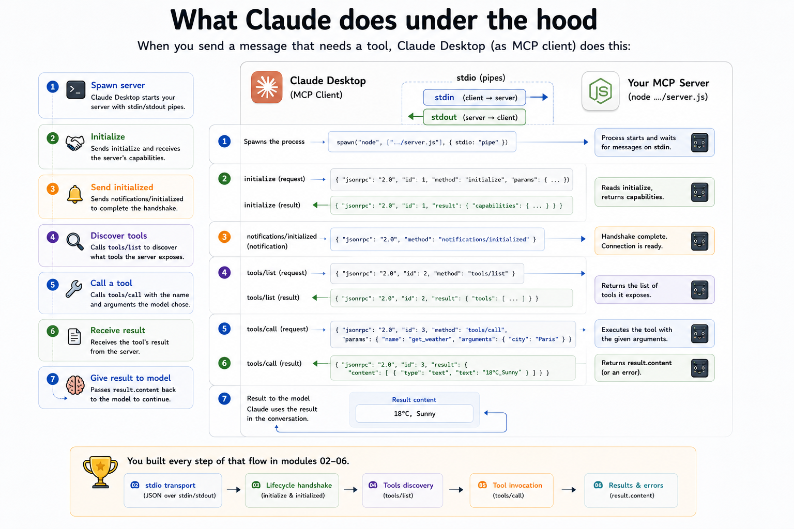

# Wire this server to Claude Desktop

**Path B only.** Path A (local): [`../run-local.md`](../run-local.md).

Before this guide: complete step 1 in [`../run-desktop.md`](../run-desktop.md) (`node 06-tools-call/src/client.js`).

Pick your OS (same JSON config everywhere; paths and logs differ):

| Platform | Guide |
|----------|--------|
| macOS | **[`connect-macos.md`](./connect-macos.md)** |
| Windows | **[`connect-windows.md`](./connect-windows.md)** |
| Linux | **[`connect-linux.md`](./connect-linux.md)** |

---

## How Claude Desktop connects (and what is allowed)

Claude Desktop is an MCP **host**. For each entry in `mcpServers`, it starts a **client** subprocess that talks to your **server** over **stdio** (stdin/stdout pipes) - the same transport you built in module 03. The host never runs your tool logic itself; it only launches the process, routes JSON-RPC, and decides when the model may call a tool.

### What you can put in `claude_desktop_config.json`

For local servers like this course project, each server is a **launcher**:

| Field | Role |
|-------|------|
| `command` | Executable to run (`node`, `npx`, `python`, a script, etc.) |
| `args` | Arguments, usually including the **absolute** path to your server entry file |
| `env` (optional) | Extra environment variables for that process only |
| `cwd` (optional) | Working directory if the server expects relative paths |

That is the supported pattern for **stdio MCP servers**: Desktop spawns `command` with `args`, wires stdin/stdout, and speaks newline-delimited JSON-RPC on those pipes. Your [server.js](./server.js) must keep **stdout** for protocol messages only - use **stderr** for debug logs, or you will corrupt the stream.

What is **not** in scope for these guides:

- **Remote** servers (HTTP + SSE or streamable HTTP) - a different transport; other hosts or connectors handle those, not the `command`/`args` block above.
- **Built-in** Desktop integrations (filesystem, connectors in the UI) - separate from user-defined `mcpServers`.
- **Editing the config while Claude is running** - changes apply only after a full quit and restart.

You may register **several** servers under `mcpServers` at once. Each gets its own subprocess and log file (named from the config key). They do not share memory or see each other’s tools unless the model uses more than one in the same chat.

### General hints

- **Trust boundary** - Anything in `mcpServers` runs with your user account. Treat entries like shell aliases: only add servers you have read or written yourself.
- **Paths and Node** - Use absolute paths in `args`; avoid `~` in JSON. If spawn fails, set `command` to the full path from `which node` / `where node` (see the OS guide).
- **Restart after edits** - Quit Claude completely (not just close the window), then reopen. MCP loads at startup only.
- **New chat to verify** - Tool lists are tied to the session; use a fresh chat when testing a config change.
- **UI approval** - Depending on your Desktop version, tool calls may need a click to approve. If nothing happens, check the tools menu and any permission prompt.
- **Logs first** - When a server fails to start, read `mcp-server-<your-key>.log` (paths are in the macOS / Windows / Linux guides) before changing code.
- **Same server, other hosts** - Cursor, MCP Inspector, and [client.js](./client.js) attach to the same [server.js](./server.js) over stdio. Inspector cannot show Claude Desktop's MCP calls - see **[`inspector.md`](./inspector.md#inspector-cannot-show-claude-desktops-mcp-calls)**.
- **Other clients in the repo** - Module 06’s [`client.js`](./client.js) is the minimal teaching client; Desktop is the “real” host most people use day to day.

---

## Shared config (all platforms)

Claude Desktop reads MCP servers from **`claude_desktop_config.json`**. You add one object under `mcpServers`:

```json
{
  "mcpServers": {
    "mcp-from-scratch": {
      "command": "node",
      "args": [
        "/ABSOLUTE/PATH/TO/mcp-from-scratch/06-tools-call/src/server.js"
      ]
    }
  }
}
```

Rules that apply on every OS:

- **`args`** must be the **absolute** path to [server.js](./server.js). Do not use `~` in the JSON file - Claude may not expand it.
- **`command`** is usually `node`. If Desktop logs `node: command not found`, use the full path from `which node` (macOS/Linux) or `where node` (Windows).
- The key **`mcp-from-scratch`** is the label in Claude’s UI. You can rename it; log files use this name as a suffix.
- If you already have other servers, **merge** into `mcpServers` - do not delete existing entries.

After editing the file: **quit Claude Desktop completely** and open it again. MCP servers load only at startup.

---

## Verify in the UI (all platforms)

1. Open a new chat.
2. Look for the tools / MCP indicator (hammer icon or “Search and tools”, depending on version).
3. You should see **mcp-from-scratch** with three tools: `add`, `echo`, `get_time`.

Ask Claude to use a tool, for example:

> Use the echo tool with message "connected"

Claude should call `tools/call` and show the result in the conversation.

---

## Module 09: MCP Prompts in Desktop and Cursor

This guide wires **tools** ([06-tools-call/src/server.js](./server.js)). **Prompts** are a different capability - user-selected templates from `prompts/list` and `prompts/get`.

After module 09, connect the prompts server instead:

- Hub: [`../../09-prompts/src/connect-prompts.md`](../../09-prompts/src/connect-prompts.md)
- Cursor: [`../../09-prompts/src/connect-cursor.md`](../../09-prompts/src/connect-cursor.md)

The module 06 server will **never** show MCP prompt templates. On Claude Desktop, pick prompts via **+ → Add from [server]** - not the `/` slash menu (see module 09 docs).

---

## What Claude does under the hood



When you send a message that needs a tool, Claude Desktop (as MCP **client**):

1. Spawns `node …/server.js` with stdin/stdout pipes.
2. Sends `initialize` → receives capabilities.
3. Sends `notifications/initialized`.
4. Calls `tools/list` to discover tools.
5. Calls `tools/call` with the name and arguments the model chose.
6. Passes `result.content` back to the model.

You built every step of that flow in modules 02–06.

---

## Security reminder

Any MCP server you attach to Claude can run code on your machine. Only add servers you trust. This teaching server is intentionally small - read [server.js](./server.js) before connecting it to a production client.

---

## Troubleshooting: model and tools

| Symptom | What to check |
|---------|----------------|
| Server connects but model **never** calls tools | Tool `description` / `inputSchema` (module 05); start a **new chat** after config changes |
| Model picks the **wrong** tool | Overlapping tool definitions - narrow descriptions or rename |
| Tool runs but user sees error text | Expected `isError: true` path (module 07) - improve the message for the model |
| Hammer works, no **MCP prompt templates** | Wrong server - prompts need module 09 (`connect-prompts.md`); on Desktop use **+ menu**, not `/` |

---

## Exercises

Practice on [`server.js`](./server.js). Each tool is one `registerTool(definition, handler)` call: the **definition** is what Claude discovers via `tools/list`; the **handler** runs when Claude sends `tools/call`.

After every code change:

1. Save [server.js](./server.js).
2. **Quit Claude Desktop completely** and reopen it (MCP reloads only at startup).
3. Open a **new chat** so the tool list is fresh.
4. Check the tools UI for your server, then ask Claude to call the tool.

Optional: smoke-test without Desktop first:

```bash
cd /path/to/mcp-from-scratch
node 06-tools-call/src/client.js
```

---

### Exercise 1 - Extend `echo`

Add an optional **`prefix`** argument. When the caller sends it, the tool returns `prefix + message` instead of the raw message.

**1. Update the definition** - inside the existing `registerTool` for `echo`, extend `inputSchema.properties` and mention the new field in `description`:

```javascript
description: 'Returns the message you send, optionally with a prefix.',
inputSchema: {
  type: 'object',
  properties: {
    message: {
      type:        'string',
      description: 'Text to echo back',
    },
    prefix: {
      type:        'string',
      description: 'Optional text to put before the message',
    },
  },
  required: ['message'],
},
```

Only `message` stays in `required` so callers can omit `prefix`.

**2. Update the handler** - replace the body of the `echo` handler (still return `textResult(...)`):

```javascript
(args) => {
  const message = args?.message;
  if (typeof message !== 'string') {
    return textResult('echo requires a string "message" argument', true);
  }
  const prefix = typeof args?.prefix === 'string' ? args.prefix : '';
  return textResult(prefix + message);
},
```

**3. Try it in Claude Desktop**

In a new chat:

> Use the echo tool with message "world" and prefix "hello "

You should see `hello world` in the tool result.

Then try without a prefix:

> Use the echo tool with message "still works"

You should get `still works` unchanged.

---

### Exercise 2 - Add a new tool

Add a tool named **`reverse`** that takes a string `text` and returns the characters in reverse order.

**1. Register it** - paste a new block **after** the existing `registerTool` calls (same file, same pattern as `echo`):

```javascript
registerTool(
  {
    name:        'reverse',
    title:       'Reverse text',
    description: 'Returns the input string with characters in reverse order.',
    inputSchema: {
      type: 'object',
      properties: {
        text: {
          type:        'string',
          description: 'Text to reverse',
        },
      },
      required: ['text'],
    },
  },
  (args) => {
    const text = args?.text;
    if (typeof text !== 'string') {
      return textResult('reverse requires a string "text" argument', true);
    }
    return textResult([...text].reverse().join(''));
  }
);
```

Tool names must match `^[A-Za-z0-9._-]{1,128}$` (see the registry in module 05).

**2. Restart and verify discovery**

Quit and reopen Claude Desktop, start a **new chat**, and open the MCP tools list. You should see **four** tools: `add`, `echo`, `get_time`, and `reverse`.

If `reverse` is missing:

- Read `mcp-server-mcp-from-scratch.log` (path in your OS connect guide) for a syntax error or crash on startup.
- Confirm you saved [server.js](./server.js) and that `claude_desktop_config.json` still points at this file.

**3. Invoke it from Claude**

> Use the reverse tool with text "MCP"

Expected result: `PCM`.

**4. Go further (optional)**

Change `description` to something more vivid, restart Desktop again, and ask:

> What does the reverse tool do?

Claude re-reads `tools/list` on a new session; an updated description helps the model pick the right tool.

Pick another idea (e.g. `slugify` a title, `count_words` in a paragraph) and add it the same way: definition + handler + `registerTool` + full restart + new chat + a direct prompt that names the tool and its arguments.
