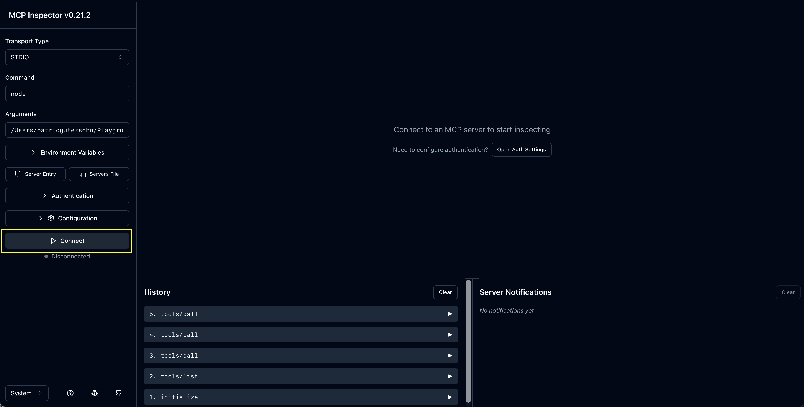
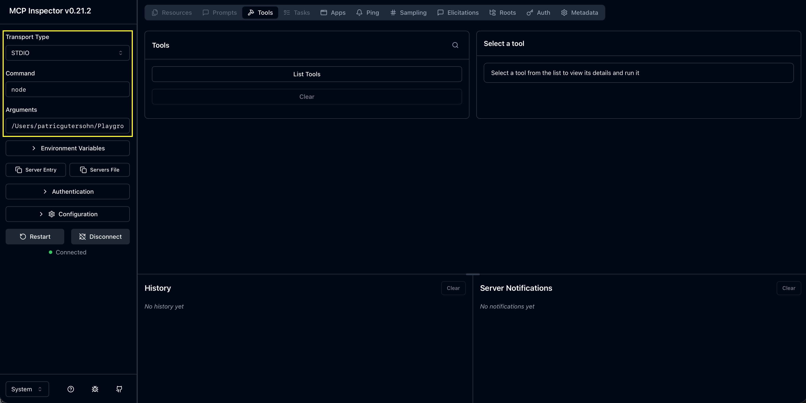

# MCP Inspector

The [MCP Inspector](https://modelcontextprotocol.io/docs/tools/inspector) is an optional browser UI for testing and debugging your server. You do not need Claude Desktop to use it.

**The MCP Inspector cannot show Claude Desktop's calls to your MCP server.** Inspector's History tab only records traffic from *its own* browser session. Claude Desktop spawns a separate server process that Inspector never sees. There is no setting, URL, or config that makes Claude route through Inspector.

Used by [`run-local.md`](../run-local.md) (optional step 3) and [`run-desktop.md`](../run-desktop.md) (optional step 2).

---

## Inspector cannot show Claude Desktop's MCP calls

Inspector is great for *you* clicking tools in the browser. It is **not** a spy tool for Claude Desktop.

| You might expect | Reality |
|------------------|---------|
| Inspector is running `server.js`, so Claude's calls appear in History | Claude starts its **own** `node server.js` - Inspector has no pipe into it |
| Point Claude at `localhost:6274` to use Inspector | That URL is for the **browser UI only**, not an MCP host endpoint |
| Inspector and Claude share one server because both use stdio | Stdio means one client **owns** one process - they cannot share |

If you need to see JSON-RPC from Claude Desktop, skip to [How to see Claude Desktop's MCP calls](#how-to-see-claude-desktops-mcp-calls) - Inspector is not an option there.

---

## Why not? (two processes)

With stdio MCP, the **client spawns the server** and owns its stdin/stdout pipes. There is no long-running server daemon that multiple clients attach to.

When you run Inspector:

```bash
npx -y @modelcontextprotocol/inspector node …/server.js
```

Inspector starts **process A**: `node server.js`. The browser talks to the Inspector proxy, which talks to **process A** over pipes. History shows only traffic for **process A**.

When Claude Desktop starts (from `claude_desktop_config.json`):

```json
"command": "node", "args": ["…/server.js"]
```

Claude spawns **process B**: a completely separate `node server.js`. Claude talks to **process B** directly. Inspector has no connection to **process B**.

Same **source file**, two **processes**, two **pipe pairs**. Running `node server.js` in two terminals gives the same result - Inspector owns one; Claude owns the other.

---

## Before you start

1. Step 1 in [`run-local.md`](../run-local.md) or [`run-desktop.md`](../run-desktop.md) passes (`node 06-tools-call/src/client.js`).
2. You have an **absolute** path to [server.js](./server.js) (no `~` in JSON config files):

```bash
# macOS / Linux
echo "$(pwd)/06-tools-call/src/server.js"

# Windows PowerShell
(Resolve-Path .\06-tools-call\src\server.js).Path
```

Stdio servers must be **spawned** by Inspector (same as [`client.js`](./client.js)). Do not run `node server.js` in one terminal and connect to `localhost` in the browser.

---

## Launch Inspector

From the repo root:

```bash
npx -y @modelcontextprotocol/inspector node /ABSOLUTE/PATH/TO/mcp-from-scratch/06-tools-call/src/server.js
```

**Keep this terminal open.** Closing it stops the proxy and the UI will disconnect.

---

## Connect in the browser

The page says **"Connect to an MCP server to start inspecting"** until you connect - that is expected. Three steps: **open the right URL → fill Server Connection → click Connect**.

### Step 1 - Open the URL printed in the terminal

After startup, the terminal prints lines like:

```
🔑 Session token: abc123…
🔗 Open inspector with token pre-filled:
   http://localhost:6274/?MCP_PROXY_AUTH_TOKEN=abc123…
```

| Do | Don't |
|----|--------|
| Click or copy **that full URL** (includes `MCP_PROXY_AUTH_TOKEN=…`) | Type only `http://localhost:6274` from memory |

Recent Inspector versions require this token so the browser can talk to the local proxy. Without it, the page may load but never connect properly.

**Already opened the bare URL?**

1. In the Inspector sidebar, click **Configuration**.
2. Find **Proxy Session Token**.
3. Paste the token from the terminal (`🔑 Session token:` line).
4. Click **Save**, then continue to Step 2.

### Step 2 - Fill in Server Connection (sidebar)

On the connect screen, find the **Connect** panel on the left.



Set these values for this course:

| Field | Value |
|-------|--------|
| **Transport type** | `STDIO` |
| **Command** | `node` |
| **Arguments** | `/ABSOLUTE/PATH/TO/mcp-from-scratch/06-tools-call/src/server.js` |



Notes:

- If you launched Inspector with `node …/server.js` on the command line, **Command** and **Arguments** may already be filled - check them, then continue.
- Use an **absolute** path (no `~`).
- This module uses **stdio** only. Do not choose SSE or Streamable HTTP unless you built an HTTP server.

Click **Connect**.

### Step 3 - Call `echo` on the Tools tab

1. Open **Tools** in the top toolbar and click **List Tools**.
2. You should see three tools: `echo`, `add`, `get_time` (same as [`client.js`](./client.js)).
3. Select **`echo`**.
4. In the message field, paste: `"hello from MCP"`
5. Click **Run Tool**.
6. Read the **Tool Result**.

**Expected:** text content `hello from MCP`.

Optional: try `add` with `{ "a": 40, "b": 2 }` → text `42`.

### Step 4 - Confirm in History (optional)

Open **History** (or the message log). You should see JSON-RPC traffic, including:

1. `initialize` request and response
2. `notifications/initialized`
3. `tools/list`
4. `tools/call` for `echo`

That is the same lifecycle as module 04 and [`run-local.md`](../run-local.md) step 1. This History is **only** from your browser session - not from Claude Desktop.

---

## Go further (optional)

| Check | Arguments | Expected |
|-------|-----------|----------|
| `add` | `{ "a": 40, "b": 2 }` | Text `42` |
| `get_time` | `{}` | ISO-8601 timestamp |
| Unknown tool | name `nonexistent` | JSON-RPC error, not `isError: true` |

Manual JSON (no browser): [`run-local.md`](../run-local.md) step 2.

---

## While editing [server.js](./server.js)

1. Change the server.
2. **Reconnect** in Inspector (or stop and re-run the `npx` command).
3. Tools tab → run one call.

Debug logs: `console.error` only - never `console.log` on stdout (corrupts the protocol stream).

| Change | Action |
|--------|--------|
| [server.js](./server.js) code | Reconnect Inspector; test one tool |
| `claude_desktop_config.json` | Full quit + reopen Claude; new chat |
| Model ignores tools | [`connect.md`](./connect.md) - descriptions, approval, new chat |

---

## After Inspector works → wire Claude Desktop

Inspector proves the server works. Claude Desktop is wired **separately** to the same file - not through Inspector.

1. **[`connect.md`](./connect.md)** - JSON under `mcpServers`
2. **Your OS** - [macOS](./connect-macos.md) · [Windows](./connect-windows.md) · [Linux](./connect-linux.md)

Same path in config:

```json
"args": ["/ABSOLUTE/PATH/TO/mcp-from-scratch/06-tools-call/src/server.js"]
```

Quit Claude completely → reopen → **new chat**.

**Export from Inspector (optional):** After connecting in the browser, use the **Server Entry** or **Servers File** buttons in the Inspector UI to copy launch config into `claude_desktop_config.json`. This copies the same `command`/`args` - it does **not** route Claude's traffic through Inspector.

---

## How to see Claude Desktop's MCP calls

**Inspector cannot do this.** Use one of these instead:

### Desktop logs (recommended)

Claude writes MCP subprocess logs on every OS. Example on macOS:

```text
~/Library/Logs/Claude/mcp-server-mcp-from-scratch.log
```

Tail while reproducing an issue:

```bash
tail -f ~/Library/Logs/Claude/mcp-server-mcp-from-scratch.log
```

Log paths for other OSes are in the [connect guides](./connect.md). Look for `initialize`, `tools/list`, and `tools/call`.

### stdio wrapper (optional, advanced)

To print Claude's JSON-RPC to a terminal or file, wrap the server in [`mcp-snoop`](https://github.com/0-co/mcp-snoop):

```json
{
  "mcpServers": {
    "mcp-from-scratch": {
      "command": "npx",
      "args": [
        "-y", "mcp-snoop", "--verbose", "--",
        "node", "/ABSOLUTE/PATH/TO/mcp-from-scratch/06-tools-call/src/server.js"
      ]
    }
  }
}
```

This is optional debugging - not required for the course.

---

## Troubleshooting

| What you see | What to do |
|--------------|------------|
| Page loads, still says "Connect to an MCP server…" | Complete connect steps: STDIO + **Connect** |
| Blank page or proxy errors | Use the terminal URL with `MCP_PROXY_AUTH_TOKEN` |
| Connect then instant disconnect | Terminal stack trace; verify path points to **06** [server.js](./server.js) |
| Connected, Tools tab empty | Reconnect; check History for failed `initialize` |
| Garbled / hung session | No `console.log` on server stdout - use stderr only |
| Inspector works, Desktop does not | Match absolute path; no `~`; full quit; new chat; `mcp-server-*.log` (OS guide) |
| Neither works | Wrong file - use **06** [server.js](./server.js) |
| Claude's calls missing from Inspector History | Expected - see [Inspector cannot show Claude Desktop's MCP calls](#inspector-cannot-show-claude-desktops-mcp-calls) |

---

## Official links

- [Inspector](https://modelcontextprotocol.io/docs/tools/inspector)
- [Debugging](https://modelcontextprotocol.io/docs/tools/debugging)
