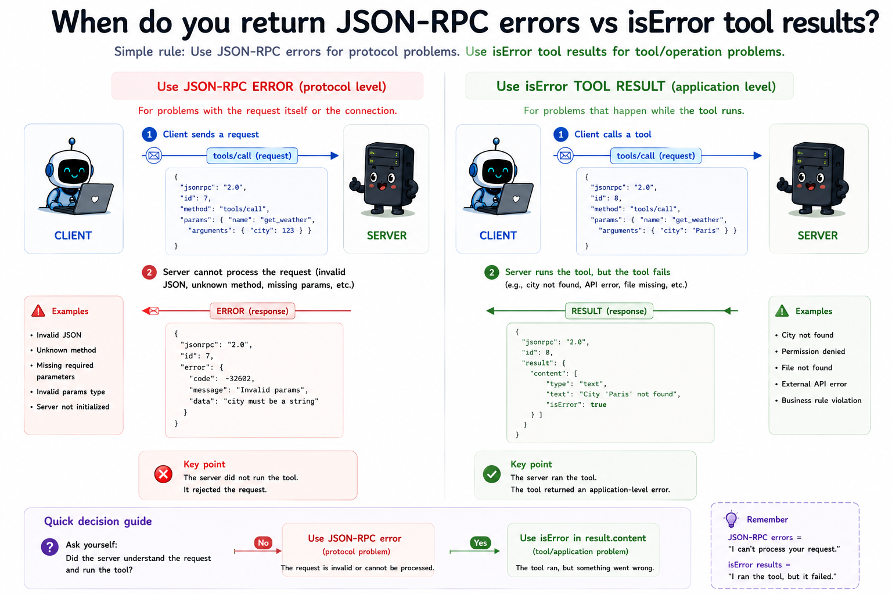

# 07 When do you return JSON-RPC errors vs `isError` tool results?

## The question

Module 06 ran tools and returned results. Some failures came back as JSON-RPC `error` objects; others came back as normal `result` payloads with `isError: true`. **When do you use which?**

This module makes that decision explicit in [errors.js](./src/errors.js) and demonstrates every path with a small demo server.

---

## Prerequisites

- Node.js 20 or later
- Run commands from the project root (`mcp-from-scratch/`)
- Modules 02–06 must be present

---

## Two layers of failure

| Layer | Wire shape | Who fixes it? |
|-------|------------|---------------|
| **Protocol error** | `{ "error": { "code", "message" } }` | Client / developer - the request is malformed or impossible |
| **Tool execution error** | `{ "result": { "content": [...], "isError": true } }` | Model - the call was valid but the tool rejected the input or failed at runtime |

The JSON-RPC call **succeeds** for tool execution errors. The HTTP-equivalent is “200 with an error payload inside the body,” not “4xx at the transport layer.”

---

## Protocol errors (JSON-RPC)

Use these when the **`tools/call` request itself** is wrong or the server cannot run it:

- Missing or empty `name`
- `arguments` is not a JSON object
- Tool name is not in `tools/list`
- Server bug (tool listed but no handler registered)

Example:

```json
{
  "jsonrpc": "2.0",
  "id": 3,
  "error": {
    "code": -32602,
    "message": "Unknown tool: nonexistent"
  }
}
```

The client’s promise rejects (or you handle `MessageType.Error`). There is no `content` array to read.

In this repo, throw helpers from [errors.js](./src/errors.js) - `invalidParams()`, `internalError()` - and the dispatcher turns them into error responses.

---

## Tool execution errors (`isError`)

Use these when the request is **valid** but the tool cannot complete the work:

- Business validation (bad email format, date in the past)
- Runtime failures (API down, division by zero)
- Wrong argument *values* that your handler checks (not wrong JSON shape)

Example:

```json
{
  "jsonrpc": "2.0",
  "id": 4,
  "result": {
    "content": [
      {
        "type": "text",
        "text": "division by zero: b must not be 0"
      }
    ],
    "isError": true
  }
}
```

The client’s promise **resolves** with a result. Check `result.isError` before treating `content` as success.

Return `toolError('message')` from handlers. Uncaught exceptions inside handlers are also converted to `toolError` so the model still gets readable text.

---

## Decision guide

```
Is the tools/call request structurally valid and does the tool exist?
  no  → throw invalidParams() or internalError()  → JSON-RPC error
  yes → run the handler
          handler returns toolError()     → result with isError: true
          handler throws (unexpected)     → catch → toolError() (same wire shape)
          handler returns toolSuccess()   → result with isError: false
```

**Rule of thumb:** if the model could fix it by changing argument *values*, prefer `isError`. If the model picked a tool that does not exist or sent malformed params, use a protocol error.

---

## What each file does

**[src/errors.js](./src/errors.js)** - `protocolError`, `invalidParams`, `internalError`, `toolError`, `toolSuccess`, `normalizeToolResult`, and helpers such as `isProtocolError`. No I/O.

**[src/server.js](./src/server.js)** - Same lifecycle as module 06. Demo tools: `echo`, `divide`, `validate_email`, `unstable`. The `tools/call` handler uses [errors.js](./src/errors.js) for every branch.

**[src/client.js](./src/client.js)** - Handshake, then runs scenarios for success, tool errors, and protocol errors. Prints which path each call took.

Run it: see [run.md](./run.md).

---

## Spec references

- Tool error handling: [https://modelcontextprotocol.io/specification/2025-11-25/server/tools#error-handling](https://modelcontextprotocol.io/specification/2025-11-25/server/tools#error-handling)
- JSON-RPC error codes: [https://www.jsonrpc.org/specification#error_object](https://www.jsonrpc.org/specification#error_object)

---

**Next:** [08-resources/README.md](../08-resources/README.md) - How does a server expose readable data as resources?
