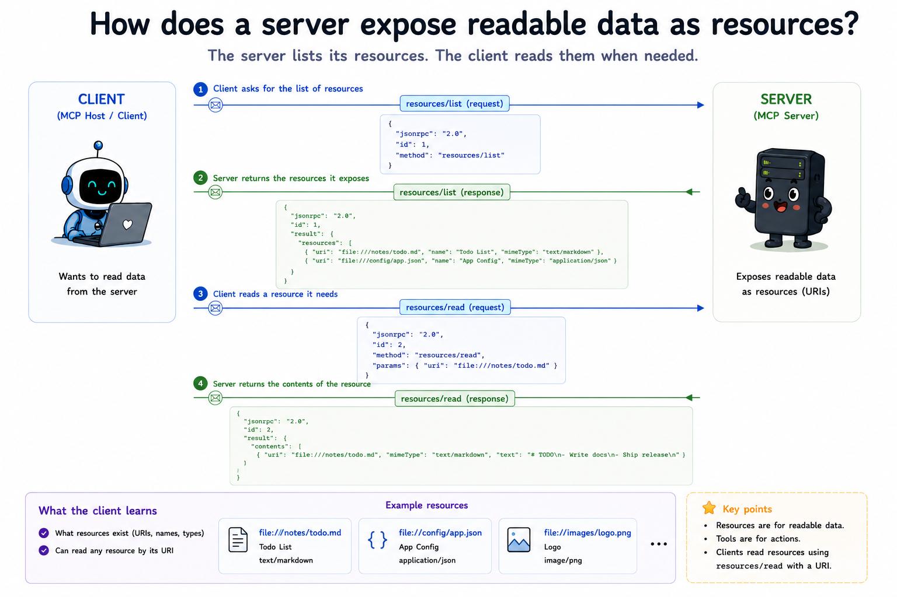
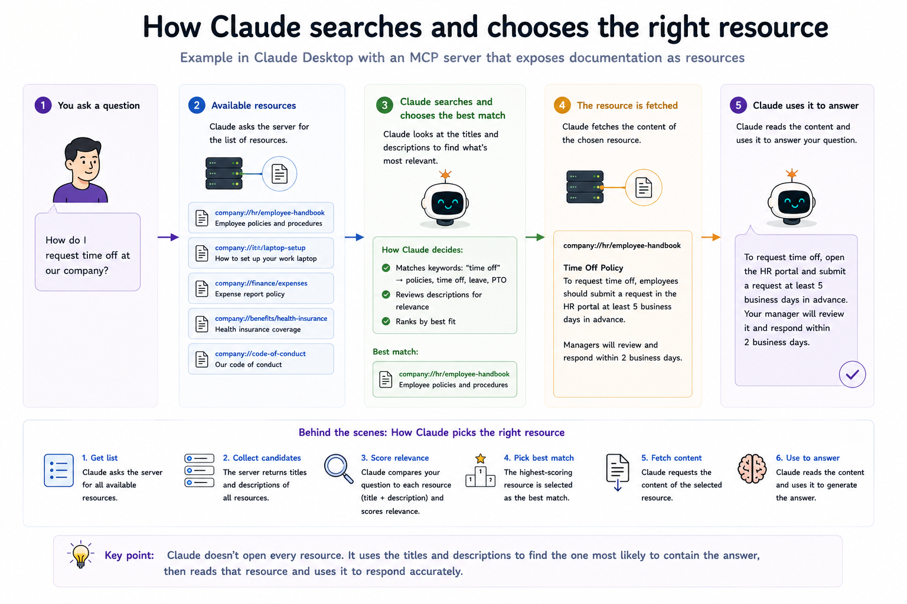

# 08 How does a server expose readable data as resources?

## The question

Modules 05–07 built **tools** - things the model can *call*. Some context is not an action: it is data the model should *read*. MCP exposes that through **resources**.

**When do you use a resource instead of a tool?**

| Primitive | Purpose | Side effects? |
|-----------|---------|----------------|
| **Tool** | Do something (compute, send, update) | Often yes |
| **Resource** | Provide read-only context (files, schemas, notes) | No - read only |

---

## Discovery vs reading

Resources have two protocol operations, parallel to tools:

| Method | Purpose | This module |
|--------|---------|-------------|
| `resources/list` | Return resource **definitions** (uri, name, description, mimeType) | Yes |
| `resources/read` | Fetch **content** for one URI | Yes |

Listing does not return file bodies. Reading does not change server state.

---

## What a resource definition looks like

Each entry in the `resources` array is a **Resource** object:

```json
{
  "uri": "demo://glossary",
  "name": "glossary",
  "title": "MCP glossary",
  "description": "Short definitions of core MCP concepts.",
  "mimeType": "text/plain"
}
```

Important fields:

- **`uri`** - unique identifier. Used again in `resources/read`.
- **`name`** - short label (required by the spec).
- **`description`** - helps the host or model choose context.
- **`mimeType`** - optional hint for rendering (`text/plain`, `application/json`, …).

---

## The request and response

After the lifecycle handshake, the client discovers resources:

```json
{
  "jsonrpc": "2.0",
  "id": 2,
  "method": "resources/list",
  "params": {}
}
```

```json
{
  "jsonrpc": "2.0",
  "id": 2,
  "result": {
    "resources": [
      {
        "uri": "demo://glossary",
        "name": "glossary",
        "description": "Short definitions of core MCP concepts.",
        "mimeType": "text/plain"
      }
    ]
  }
}
```

To fetch content:

```json
{
  "jsonrpc": "2.0",
  "id": 3,
  "method": "resources/read",
  "params": {
    "uri": "demo://glossary"
  }
}
```

```json
{
  "jsonrpc": "2.0",
  "id": 3,
  "result": {
    "contents": [
      {
        "uri": "demo://glossary",
        "mimeType": "text/plain",
        "text": "Host     - Application that runs the AI..."
      }
    ]
  }
}
```

Each content block includes the **`uri`** again so clients can match multi-resource responses. Text resources use **`text`**; binary resources use **`blob`** (base64).

---

## Server capabilities

Servers that expose resources declare the `resources` capability during `initialize`:

```json
{
  "capabilities": {
    "resources": {
      "listChanged": true
    }
  }
}
```

`listChanged: true` means the server may send `notifications/resources/list_changed` when the catalogue changes (module 10). This module only implements list and read.



---

## Error handling

| Situation | Code | Layer |
|-----------|------|-------|
| Missing or empty `uri` in `resources/read` | `-32602` Invalid params | Protocol |
| URI not in `resources/list` | `-32002` Resource not found | Protocol |

Both are JSON-RPC **errors** - the request failed. There is no `isError` flag on resources (that pattern belongs to tools).

---

## What each file does

**[src/registry.js](./src/registry.js)** - In-memory store for resource definitions and reader functions. `register()` validates each resource; `list()` returns definitions sorted by uri; `read()` invokes the reader.

**[src/server.js](./src/server.js)** - Same lifecycle gate as earlier modules, plus `resources/list` and `resources/read`. Three demo resources use the custom `demo://` scheme.

**[src/client.js](./src/client.js)** - Handshake, proves `resources/list` is rejected before initialize, lists resources, reads each one, then demonstrates not-found and invalid-params errors.

Run it: see [run.md](./run.md).

---

## Definitions live separately from readers

Like tools in module 05, the registry stores **metadata** only. The reader function runs only when `resources/read` arrives. That separation keeps discovery cheap and makes URIs the stable contract between client and server.

---

## Spec references

- Resources: [https://modelcontextprotocol.io/specification/2025-11-25/server/resources](https://modelcontextprotocol.io/specification/2025-11-25/server/resources)
- Lifecycle (must complete before `resources/list`): [https://modelcontextprotocol.io/specification/2025-11-25/basic/lifecycle](https://modelcontextprotocol.io/specification/2025-11-25/basic/lifecycle)

---

**Next:** [09-prompts/README.md](../09-prompts/README.md) - How does a server expose reusable prompt templates?
