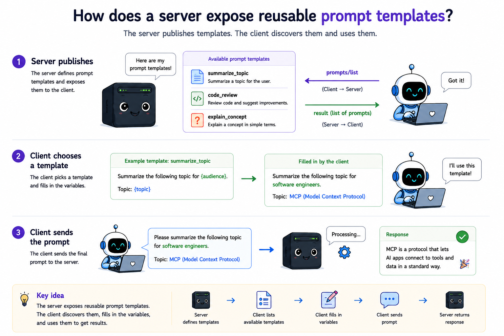

# 09 How does a server expose reusable prompt templates?

## The question

Modules 05–08 built **tools** (callable actions) and **resources** (read-only data). MCP also defines **prompts** - parameterized templates the **user** picks in the host UI. The server returns structured `messages` for the host to inject into the chat.

**When do you use a prompt instead of a tool or resource?**

| Primitive | Purpose | Who initiates | Side effects? |
|-----------|---------|---------------|---------------|
| **Tool** | Do something in the world | Model (via host) | Often yes |
| **Resource** | Read context data | Host / model reads | No |
| **Prompt** | Seed a conversation with a template | **User** (host UI picker) | No |

Prompts are **user-controlled**. The model does not autonomously call `prompts/get` the way it calls `tools/call`. See [Connect prompts to a host](#connect-prompts-to-a-host) below.

**Not sampling:** Module 11 **sampling** is the server asking the **client's model** for help. Prompts return text **to** the host; the host decides when to call the model.

---

## Prerequisites

- Node.js 20 or later
- Run commands from the project root (`mcp-from-scratch/`)
- Modules 02–07 must be present

---

## Discovery vs fetch

| Method | Purpose | This module |
|--------|---------|-------------|
| `prompts/list` | Return prompt **definitions** (name, description, arguments) | Yes |
| `prompts/get` | Build **messages** for one prompt with arguments | Yes |

Listing does not run templates. Fetching does not change server state.

---

## Three primitives at a glance

| Primitive | Protocol | Returns |
|-----------|----------|---------|
| Tool | `tools/list`, `tools/call` | Tool result `content` |
| Resource | `resources/list`, `resources/read` | `contents` (data) |
| Prompt | `prompts/list`, `prompts/get` | `messages` (conversation seed) |

---

## What a prompt definition looks like

Each entry in the `prompts` array is a **Prompt** object:

```json
{
  "name": "summarize",
  "title": "Summarize text",
  "description": "Summarize the given text in a few sentences.",
  "arguments": [
    {
      "name": "text",
      "description": "Text to summarize",
      "required": true
    }
  ]
}
```

Important fields:

- **`name`** - unique identifier. Used again in `prompts/get`.
- **`description`** - helps the user choose in the host UI.
- **`arguments`** - optional list of `{ name, description?, required? }`. Not JSON Schema like tools - a simpler list per the spec.

---

## The request and response

After the lifecycle handshake, the client discovers prompts:

```json
{
  "jsonrpc": "2.0",
  "id": 2,
  "method": "prompts/list",
  "params": {}
}
```

```json
{
  "jsonrpc": "2.0",
  "id": 2,
  "result": {
    "prompts": [
      {
        "name": "summarize",
        "title": "Summarize text",
        "description": "Summarize the given text in a few sentences.",
        "arguments": [
          { "name": "text", "description": "Text to summarize", "required": true }
        ]
      }
    ]
  }
}
```

To fetch a rendered template:

```json
{
  "jsonrpc": "2.0",
  "id": 3,
  "method": "prompts/get",
  "params": {
    "name": "summarize",
    "arguments": {
      "text": "MCP connects hosts to tool servers."
    }
  }
}
```

```json
{
  "jsonrpc": "2.0",
  "id": 3,
  "result": {
    "description": "Summarize the given text",
    "messages": [
      {
        "role": "user",
        "content": {
          "type": "text",
          "text": "Summarize the following in 2–3 sentences:\n\nMCP connects hosts to tool servers."
        }
      }
    ]
  }
}
```

The host inserts `messages` into the conversation - it does not treat this like a tool result.

---

## Server capabilities

Servers that expose prompts declare the `prompts` capability during `initialize`:

```json
{
  "capabilities": {
    "prompts": {
      "listChanged": true
    }
  }
}
```

`listChanged: true` means the server may send `notifications/prompts/list_changed` when the catalogue changes (module 10 demonstrates list_changed for tools and resources; the same pattern applies to prompts).

---

## Tools vs prompts in the host UI

| | Tools (module 06) | Prompts (this module) |
|---|-------------------|------------------------|
| Discovery | `tools/list` | `prompts/list` |
| Who triggers | Model (via host) | **User** |
| Claude Desktop UI | Hammer, tool approval | **+ → Add from server** |
| Claude Code UI | Tool calls | `/mcp__<server>__<prompt>` |
| Cursor UI | Tool calls | `/` or MCP Prompts panel |
| Wire call | `tools/call` | `prompts/get` |
| Server file | [06-tools-call/src/server.js](../06-tools-call/src/server.js) | [09-prompts/src/server.js](./src/server.js) |

Connecting the module 06 server to Claude Desktop shows **tools only**. Prompts require this module's server. On Claude Desktop, MCP prompts are **not** in the `/` slash menu - use the **+** attachment menu instead.

---

## Connect prompts to a host

After [`run.md`](./run.md) section 1 passes, connect a real host:

| Platform | Guide |
|----------|--------|
| Overview | **[`src/connect-prompts.md`](./src/connect-prompts.md)** |
| macOS (Claude Desktop) | **[`src/connect-prompts-macos.md`](./src/connect-prompts-macos.md)** |
| Windows (Claude Desktop) | **[`src/connect-prompts-windows.md`](./src/connect-prompts-windows.md)** |
| Linux (Claude Desktop) | **[`src/connect-prompts-linux.md`](./src/connect-prompts-linux.md)** |
| Cursor | **[`src/connect-cursor.md`](./src/connect-cursor.md)** |

Optional browser UI (no host required): **[`src/inspector.md`](./src/inspector.md)** - list prompts and run `prompts/get` in the MCP Inspector before debugging Desktop or Cursor.

---

## Error handling

| Situation | Code | Layer |
|-----------|------|-------|
| Missing or empty `name` in `prompts/get` | `-32602` | Protocol |
| Unknown prompt name | `-32602` | Protocol |
| Missing required argument | `-32602` | Protocol |

Per the spec, invalid prompt names and missing required arguments use JSON-RPC errors, not a separate application layer.

---

## What each file does

**[src/registry.js](./src/registry.js)** - In-memory store for prompt definitions and resolver functions. `register()` validates each prompt; `list()` returns definitions sorted by name; `resolve()` validates arguments and returns `{ description?, messages }`.

**[src/demo-prompts.js](./src/demo-prompts.js)** - Shared registration for the three tutorial prompts (`summarize`, `code_review`, `explain_concept`).

**[src/server.js](./src/server.js)** - Same lifecycle gate as earlier modules, plus `prompts/list`, `prompts/get`, the usual `tools/list` / `tools/call` plumbing, and a `list_prompt_templates` tool so Claude Desktop shows this server in Konnektoren.

**[src/client.js](./src/client.js)** - Handshake, proves `prompts/list` is rejected before initialize, lists prompts, fetches each one, then demonstrates not-found and missing-argument errors.

**[src/inspector.md](./src/inspector.md)** - Optional MCP Inspector walkthrough: connect over stdio, list prompts, and run `prompts/get` for `summarize` and `code_review` in the browser.

Run it: see [run.md](./run.md).

---

## Definitions live separately from resolvers

Like tools in module 05 and resources in module 08, the registry stores **metadata** only. The resolver runs only when `prompts/get` arrives. That keeps discovery cheap and makes prompt names the stable contract between client and server.

---

## Before you move on

1. How is a Prompt different from a Tool?
2. Who initiates `prompts/get` - the model or the user?
3. What does `prompts/get` return that `tools/call` does not?
4. Why will module 06's server never show MCP prompt templates in Desktop?
5. How is sampling (module 11) different from prompts?
6. Where do you pick MCP prompts in Claude Desktop - `/` or **+** menu?

---

## Spec references

- Prompts: [https://modelcontextprotocol.io/specification/2025-11-25/server/prompts](https://modelcontextprotocol.io/specification/2025-11-25/server/prompts)
- Lifecycle (must complete before `prompts/list`): [https://modelcontextprotocol.io/specification/2025-11-25/basic/lifecycle](https://modelcontextprotocol.io/specification/2025-11-25/basic/lifecycle)

---

**Next:** [10-notifications/README.md](../10-notifications/README.md) - How does the server push updates without the client asking?
