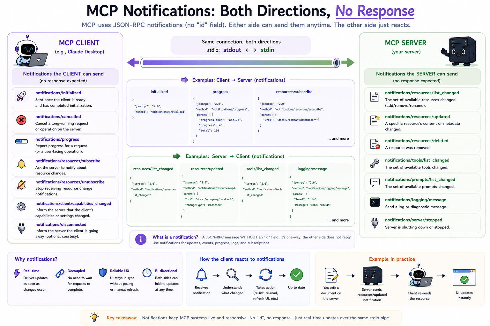

# 10 How does the server push updates without the client asking?

## The question

Modules 05–08 are **request-driven**: the client sends a method, the server replies. That works for discovery and one-off reads, but some server state changes **after** the client has already listed tools or read a resource.

MCP solves that with **server-initiated notifications** - JSON-RPC messages with **no `id`** and **no response**. The client listens on the same stdout/stdin pipe and reacts (re-list, re-read, refresh UI).

---

## Requests vs notifications (both directions)

| Direction | Who sends | Has `id`? | Expects reply? | Example |
|-----------|-----------|-----------|----------------|---------|
| Client → Server | Client | Yes (request) | Yes | `tools/list` |
| Client → Server | Client | No (notification) | No | `notifications/initialized` |
| Server → Client | Server | No (notification) | No | `notifications/tools/list_changed` |

Module 04 introduced client → server notifications for the handshake. This module flips the arrow: the **server** writes notifications to stdout whenever something changed that the client should refresh.

---

## Capability flags advertise what to expect

During `initialize`, the server tells the client which push features it supports:

```json
{
  "capabilities": {
    "tools": {
      "listChanged": true
    },
    "resources": {
      "listChanged": true,
      "subscribe": true
    }
  }
}
```

| Flag | Meaning |
|------|---------|
| `tools.listChanged` | Server may send `notifications/tools/list_changed` when tools are added or removed |
| `resources.listChanged` | Server may send `notifications/resources/list_changed` when the catalogue changes |
| `resources.subscribe` | Client may call `resources/subscribe`; server may send `notifications/resources/updated` for that URI |

If a capability is absent, the client should not expect (or send) the matching messages.

---

## Three notification types in this module

### 1. Tool catalogue changed

```json
{
  "jsonrpc": "2.0",
  "method": "notifications/tools/list_changed"
}
```

No `params`. The client should call `tools/list` again to see new or removed tools.

### 2. Resource catalogue changed

```json
{
  "jsonrpc": "2.0",
  "method": "notifications/resources/list_changed"
}
```

No `params`. The client should call `resources/list` again.

### 3. One resource's content changed

After the client subscribes:

```json
{
  "jsonrpc": "2.0",
  "id": 4,
  "method": "resources/subscribe",
  "params": {
    "uri": "demo://status"
  }
}
```

The server may later push:

```json
{
  "jsonrpc": "2.0",
  "method": "notifications/resources/updated",
  "params": {
    "uri": "demo://status"
  }
}
```

The client should call `resources/read` for that URI - the notification does not include the new body.

---

## How the demo server triggers notifications

Three teaching tools mutate state and push the matching notification:

| Tool | Effect | Notification |
|------|--------|----------------|
| `publish_status` | Updates `demo://status` text | `notifications/resources/updated` (subscribers only) |
| `add_note` | Registers `demo://note/N` | `notifications/resources/list_changed` |
| `register_extra_tool` | Adds `greet` to the tool registry | `notifications/tools/list_changed` |

Notifications are only sent when the session is **READY** (after the handshake). The server writes them with `encodeNotification()` directly to stdout - the same transport as responses, but without an `id`.

---

## What each file does

**[src/server.js](./src/server.js)** - Full MCP server from earlier modules, plus `notifyClient()`, subscription tracking, `resources/subscribe`, and tools that emit the three notification types.

**[src/client.js](./src/client.js)** - Handshake, initial discovery, subscribe to `demo://status`, then calls each demo tool. Incoming notifications trigger automatic `tools/list`, `resources/list`, or `resources/read` so you can see the refresh loop in the log.

Run it: see [run.md](./run.md).

---

## What good clients do

1. Parse notifications on the same stream as responses (module 03 framing still applies).
2. Never send a JSON-RPC response to a notification - there is no `id`.
3. Re-fetch only what changed: list notifications → `tools/list` or `resources/list`; updated → `resources/read` for that URI.
4. Ignore notification types the server did not advertise in `initialize`.

Production hosts often debounce rapid `list_changed` bursts; this module sends one notification per change so the log stays easy to follow.

---

## Spec references

- Tools (list changed): [https://modelcontextprotocol.io/specification/2025-11-25/server/tools](https://modelcontextprotocol.io/specification/2025-11-25/server/tools)
- Resources (list changed, subscribe, updated): [https://modelcontextprotocol.io/specification/2025-11-25/server/resources](https://modelcontextprotocol.io/specification/2025-11-25/server/resources)
- JSON-RPC notifications: [https://modelcontextprotocol.io/specification/2025-11-25/basic/index](https://modelcontextprotocol.io/specification/2025-11-25/basic/index)

---

**Next:** [11-sampling/README.md](../11-sampling/README.md) - How does the server ask the client's model for help?
