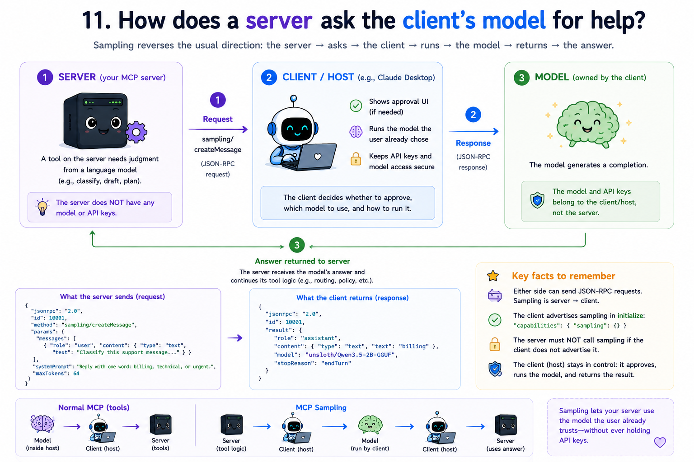

# 11 How does the server ask the client's model for help?

## The question

Modules 05–09 keep the request arrow pointing **client → server**. The host's model calls your tools; your server never talks to the model directly.

Some servers need the opposite: they want a language model to draft text, classify input, or plan steps **without** holding API keys. MCP **sampling** lets the server send `sampling/createMessage` to the **client**. The client (inside the host) runs the model the user already chose, applies approval UI, and returns the completion.

### Why not summarize?

A tool that asks the model to summarize text duplicates what the chat model already does. Sampling is useful when the **server** needs judgment **inside** a tool - classify this ticket, parse this date, decide which policy applies - and then applies **its own rules** to the model's answer. This module's `route_support_ticket` tool does exactly that: sampling supplies a category label; the server maps it to a team and SLA the model never saw.

---

## Server-initiated requests (not notifications)

Module 09 used **notifications** (no `id`, no reply). Sampling uses a full **JSON-RPC request** from server to client:

| Shape | Has `id`? | Expects reply? | Who sends |
|-------|-----------|----------------|-----------|
| Notification | No | No | Either side |
| Request | Yes | Yes | Either side |

The server writes a line with `method`, `id`, and `params`. The client answers with a `result` (or `error`) carrying the **same** `id`.

---

## Capability negotiation

The client advertises sampling during `initialize`:

```json
{
  "capabilities": {
    "sampling": {}
  }
}
```

If `sampling` is missing, the server must not call `sampling/createMessage` (the client would reject or ignore it).

The server does **not** declare `sampling` in its own capabilities - sampling is a **client** feature the server may *use* when present.

---

## Creating a message

**Server → client request:**

```json
{
  "jsonrpc": "2.0",
  "id": 10001,
  "method": "sampling/createMessage",
  "params": {
    "messages": [
      {
        "role": "user",
        "content": {
          "type": "text",
          "text": "Classify this support message:\n\nI was double-charged on last month's invoice and need a refund."
        }
      }
    ],
    "systemPrompt": "You classify support tickets. Reply with exactly one word: billing, technical, or urgent.",
    "maxTokens": 64
  }
}
```

**Client → server response:**

```json
{
  "jsonrpc": "2.0",
  "id": 10001,
  "result": {
    "role": "assistant",
    "content": {
      "type": "text",
      "text": "billing"
    },
    "model": "unsloth/Qwen3.5-2B-GGUF",
    "stopReason": "endTurn"
  }
}
```

Production clients show the prompt to the user, call their real model, and return the assistant message. This module’s client runs a **real local model** ([unsloth/Qwen3.5-2B-GGUF](https://huggingface.co/unsloth/Qwen3.5-2B-GGUF), Q6_K) via [node-llama-cpp](https://node-llama-cpp.withcat.ai/) - no cloud API keys on the server or client.

---

## Prerequisites

- Node.js 20+
- `npm install` inside [11-sampling/](.) (pulls `node-llama-cpp`)
- ~1.6 GB disk for the Q6_K GGUF (downloaded on first run into the shared top-level [models/](../models/) cache and reused by other modules)
- Classification label is **non-deterministic** - the model may reply differently each run; the routing structure (category → team → SLA) is deterministic once parsed

Optional environment variables (see [src/llm.js](./src/llm.js)):

| Variable | Purpose |
|----------|---------|
| `GGUF_MODEL` | Override default `hf:unsloth/Qwen3.5-2B-GGUF:Q6_K` or point to a local `.gguf` |
| `LLM_CONTEXT_SIZE` | Context window (default `4096`) |
| `LLM_GPU_LAYERS` | GPU layers to offload (if unset, node-llama-cpp defaults apply) |

---

## How the demo wires it together

1. **Client** loads the GGUF model, then spawns the server and declares `sampling: {}` in `initialize`.
2. **Server** stores `clientCapabilities` from `initialize`. If `sampling` is present, tool `route_support_ticket` may run.
3. When `route_support_ticket` is called, the server builds a `sampling/createMessage` request to classify the message, writes it to stdout, and **waits** for the matching response on stdin (outbound id space starts at `10000` so it does not collide with the client's `1`, `2`, `3`…).
4. The client handles `sampling/createMessage` by calling the local Qwen model (`runSampling` in [llm.js](./src/llm.js)) and returns `role`, `content`, `model`, and `stopReason`.
5. The server parses the category label, looks up its hardcoded routing table, and returns structured output (category, team, SLA) in the `tools/call` result.

---

## What each file does

**[src/server.js](./src/server.js)** - Full MCP server from earlier modules, plus `requestClient()` for outbound requests and `route_support_ticket` that classifies via sampling then applies server-side routing rules. No npm dependencies; still runs with plain `node`.

**[src/llm.js](./src/llm.js)** - Loads GGUF via node-llama-cpp; implements `initLlm`, `runSampling`, `disposeLlm`.

**[src/client.js](./src/client.js)** - Teaching host: local LLM + handshake with `sampling` capability + `sampling/createMessage` handler, then calls `route_support_ticket` to exercise the loop.

**[package.json](../package.json)** - Module 11 is the only protocol module whose **client** requires `npm install` (native bindings for local inference).

Run it: see [run.md](./run.md).

---

## Trust and safety (real hosts)

The specification expects a **human in the loop**: review prompts, edit if needed, approve before the model runs. This teaching client auto-approves so the log stays short. When you connect a real host (Claude Desktop, Cursor, etc.), that UI is the host's job - your server only sends the request.

---

## Spec references

- Sampling: [https://modelcontextprotocol.io/specification/2025-11-25/client/sampling](https://modelcontextprotocol.io/specification/2025-11-25/client/sampling)
- Lifecycle and capabilities: [https://modelcontextprotocol.io/specification/2025-11-25/basic/lifecycle](https://modelcontextprotocol.io/specification/2025-11-25/basic/lifecycle)
- JSON-RPC requests: [https://modelcontextprotocol.io/specification/2025-11-25/basic/index](https://modelcontextprotocol.io/specification/2025-11-25/basic/index)

---

**You have finished the learning path.** Re-read the full specification - you now have the vocabulary for every major server and client feature in MCP `2025-11-25`.
