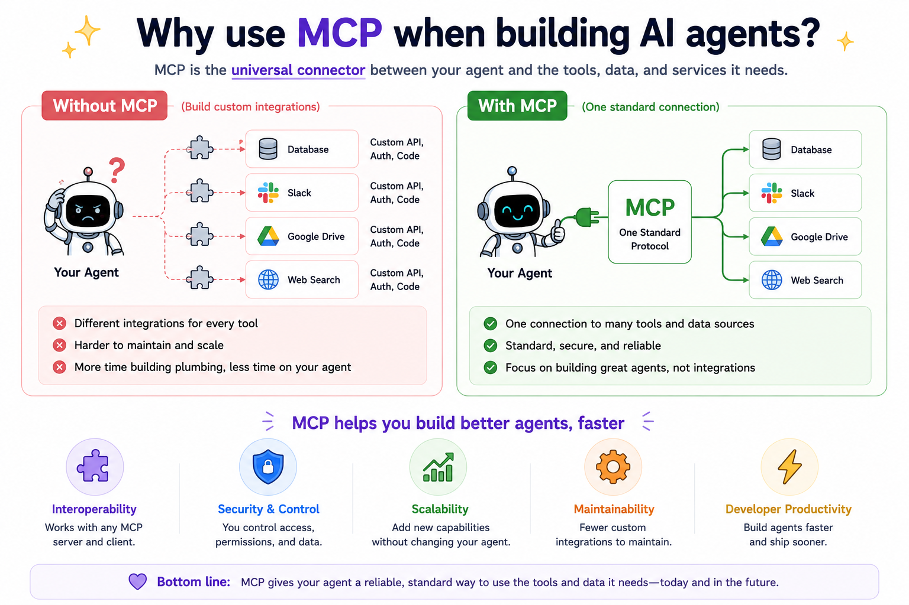
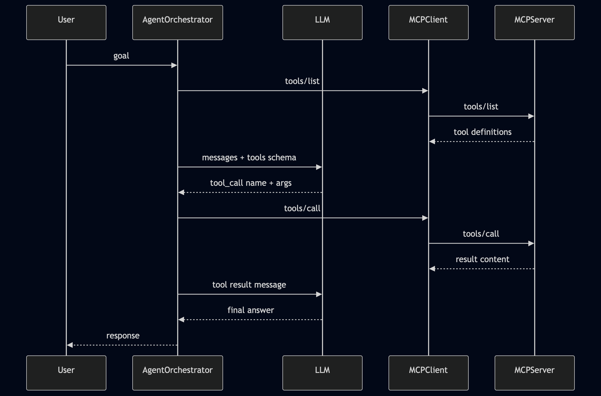
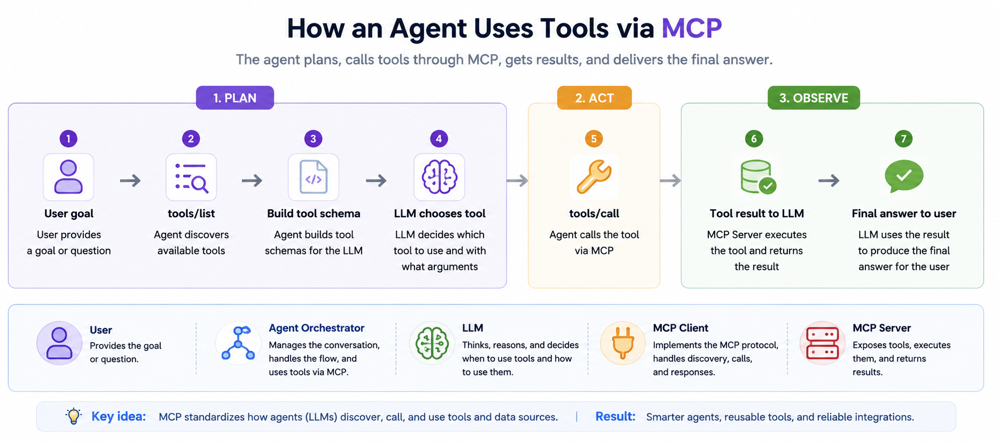
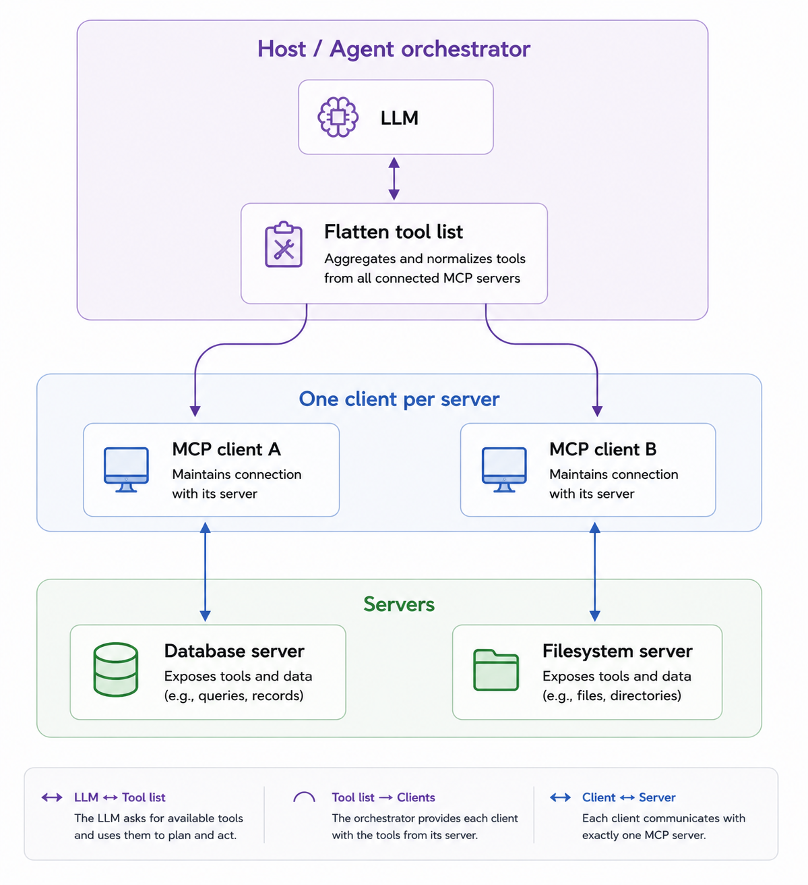

# 12 Why use MCP when building AI agents?

**The question this module answers:** you can wire tools directly into an agent - so why add MCP, and how does it fit LangChain or a hand-rolled LLM workflow?

Read modules 01–06 first (especially [06-tools-call](../06-tools-call/README.md)). This module is a capstone: it connects protocol knowledge to **agent orchestration**. Modules 07–11 deepen the protocol but are not required to run the examples here.

---

## Start here: the agent loop you already know

An **AI agent** is a loop:

1. **Plan** - understand the user’s goal and decide what to do next.
2. **Act** - call a tool, API, or script to change or fetch something in the world.
3. **Observe** - read the tool result and decide whether to act again or answer the user.

The LLM handles planning and wording. Something else must **execute** tools reliably and **describe** them so the model knows what exists.

Without MCP, that “something else” is usually code you write inside the agent: `getWeather()`, `readFile()`, `queryDb()` - each with its own wrapper, schema, and error shape. That works until you have many tools, many agents, or many hosts (your script, Claude Desktop, Cursor, a LangGraph deployment).

MCP standardizes the **Act** step’s interface: discovery (`tools/list`) and execution (`tools/call`) over a session you already built in modules 02–06.

---

## Diagrams

These show the same three actors from module 01, with an LLM and an agent loop in the middle.

### Single-server agent loop



In this module’s custom example, [src/agent-loop.js](./src/agent-loop.js) is the **Host**, [src/mcp-session.js](./src/mcp-session.js) is the **MCP Client**, and the module 06 server is the **MCPServer**. [src/llm.js](./src/llm.js) is the **LLM** layer: it runs a local GGUF model through `node-llama-cpp`, so you still do not need a cloud API key.

### Plan, act, observe



MCP owns the **Act** step’s wire format. The **Host** owns everything else: when to call the model, which servers are allowed, and whether a tool needs human approval.

### Multiple MCP servers



Claude Desktop and LangChain’s `MultiServerMCPClient` both follow this shape: several isolated servers, one combined tool surface for the model.

---

## Module 01 terms, in agent language

| Module 01 | In an agent workflow |
|-----------|----------------------|
| **Host** | Your orchestrator: [src/agent-loop.js](./src/agent-loop.js), a LangGraph app, or a prebuilt agent such as `createReactAgent` |
| **Client** | [src/mcp-session.js](./src/mcp-session.js) or `@langchain/mcp-adapters` - owns the MCP connection |
| **Server** | Capability plugins (module 06 server, filesystem server, DB server, …) |
| **tools/list** | Before an LLM turn: publish what the model may call |
| **tools/call** | After the model emits a tool call: run it and return `content` |

If module 01 felt abstract, picture the **Host** sitting between the user, the LLM, and one or more MCP clients.

---

## Why MCP for agents (not instead of your framework)

**Separation of concerns.** The LLM reasons over text. MCP servers execute capabilities. The host enforces policy: which servers are allowed, whether a call needs confirmation, logging, retries.

**Write tools once, use everywhere.** The server from module 06 is the same binary you can register in Claude Desktop, spawn from this agent loop, or attach in LangChain - no copy-paste wrappers per application.

**Composition.** Real hosts connect to multiple servers (database + filesystem + browser). Each server stays isolated; the host merges tool lists for the model. That matches how Claude Desktop and `MultiServerMCPClient` work.

**Stateful capabilities.** MCP sessions stay alive between turns. A browser or DB connection can persist across `tools/call` invocations - awkward for one-shot REST per call.

**Not either/or with LangChain.** Use LangChain `StructuredTool` / `@tool` for logic that only exists inside your app. Use MCP for **shared, standardized, host-agnostic** capabilities (official [LangChain MCP docs](https://docs.langchain.com/oss/javascript/langchain/mcp)).

---

## Where MCP sits in the stack

```
User
  ↓
Agent host (your loop / LangChain / LangGraph)
  ├── LLM API (reasoning, tool choice)
  └── MCP client(s) → MCP server(s) → APIs, files, DBs
```

The LLM never speaks MCP JSON directly. The **host** translates: `tools/list` → tool schema for the provider → model output → `tools/call`.

---

## Custom agent: what we built in `src/`

This repository’s rule is **no npm dependencies** in modules 01–10. Module 12 now follows module 11’s local-model approach: `npm install` in this folder pulls `node-llama-cpp`, but the agent loop itself stays small and explicit. The GGUF lives in the shared top-level [`models/`](../models/) cache, so module 11 and module 12 reuse the same downloaded file.

| File | Role |
|------|------|
| [`mcp-session.js`](./src/mcp-session.js) | Spawn server, handshake, `listTools()`, `callTool()` |
| [`tool-schema.js`](./src/tool-schema.js) | MCP Tool → neutral schema (same job as adapter translation) |
| [`llm.js`](./src/llm.js) | Loads GGUF via `node-llama-cpp`; chooses a tool call and writes the final answer |
| [`agent-loop.js`](./src/agent-loop.js) | Plan → act → observe in one script |

[`tool-schema.js`](./src/tool-schema.js) copies each tool's `description` and `inputSchema` from `tools/list` **verbatim** into the model API. Weak definitions from module 05 propagate unchanged - garbage in, garbage out. See **Designing tools the model can choose** in [module 05](../05-tools-list/README.md).

**MCP prompts** (module 09) are user-selected templates in Desktop/Cursor - this agent loop uses **tools** only, not `prompts/get`.

The loop uses the **module 06 server** ([`06-tools-call/src/server.js`](../06-tools-call/src/server.js)) - `echo`, `add`, `get_time`.

Run it: see [run.md](./run.md).

**Swapping the local model for a provider API:** send `toOpenAiTools(modelTools)` (in [src/tool-schema.js](./src/tool-schema.js)) to OpenAI or map `parameters` to Anthropic `input_schema`, parse the model’s tool call, then `mcp.callTool(name, args)` and append the result as a tool message before the next model turn.

---

## LangChain: optional runnable example

The folder [`langchain-example/`](./langchain-example/) is the **only** place in this repo that installs npm packages. It uses `@langchain/mcp-adapters` to:

1. Connect via **stdio** to the same module 06 server.
2. Load tools with `getTools()` (handles `tools/list` + schema translation).
3. Run `createReactAgent` with a real model (requires `OPENAI_API_KEY`).

That is the same architecture as [src/agent-loop.js](./src/agent-loop.js), with the session and routing delegated to the adapter.

---

## MCP tools vs LangChain-only tools

| Approach | Best for |
|----------|----------|
| **Inline functions in the agent** | Quick prototypes, one-off scripts |
| **LangChain `StructuredTool`** | App-specific tools tied to one codebase |
| **MCP servers** | Shared capabilities across hosts; long-lived sessions; third-party tool packs |
| **MCP + LangChain adapter** | Production agents that should reuse standard servers without rewriting wrappers |

---

## Multiple servers (sketch)

```javascript
// Conceptual: two stdio children, one merged tool list for the model
const db   = await createMcpSession('/path/to/db-server.js');
const fs   = await createMcpSession('/path/to/fs-server.js');
const tools = [
  ...mcpToolsToModelTools(await db.listTools()),
  ...mcpToolsToModelTools(await fs.listTools()),
];
// Prefix names (db_query vs fs_read) if collisions matter - LangChain can do this for you
```

LangChain’s `MultiServerMCPClient` automates spawning, handshake, and merging; see [langchain-example/README.md](./langchain-example/README.md).

---

## Python note

This module’s runnable LangChain example is **JavaScript** to match the course. Python agents use the same ideas with [`langchain-mcp-adapters`](https://docs.langchain.com/oss/python/langchain/mcp) and `MultiServerMCPClient` on the Python side.

---

## Before you move on

1. In an agent loop, what is the host responsible for versus the MCP client?
2. Why call `tools/list` before sending tools to the LLM?
3. What happens on the wire when the model chooses `echo` with `{ "message": "hi" }`?
4. When would you use MCP instead of only LangChain `@tool` definitions?
5. Why can the same `06-tools-call` server work in Claude Desktop and in your agent?

---

## Specification reference

- Architecture: [https://modelcontextprotocol.io/specification/2025-11-25/architecture](https://modelcontextprotocol.io/specification/2025-11-25/architecture)
- Tools: [https://modelcontextprotocol.io/specification/2025-11-25/server/tools](https://modelcontextprotocol.io/specification/2025-11-25/server/tools)
