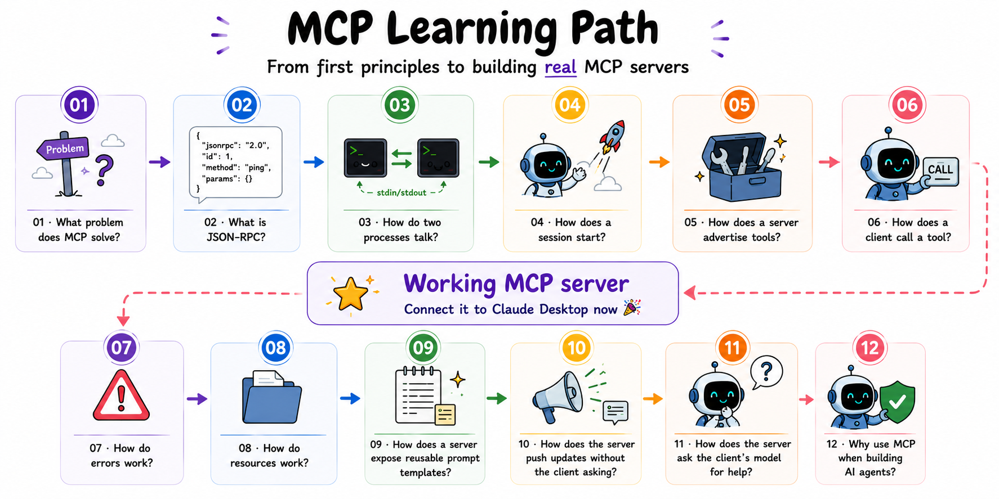

# MCP from Scratch

A learning repository for complete beginners. No frameworks. No black boxes. Pure Node.js.

By the end you will have built a working MCP server you can connect to Claude Desktop - and you will understand every line of it.

**Start with [`01-what-is-mcp/README.md`](./01-what-is-mcp/README.md).** That module explains what MCP is, why it exists, and the mental model every later module builds on. 

---

## What you will build

A fully working MCP server in plain Node.js that exposes real tools, follows the protocol exactly, and connects to Claude Desktop (or any MCP client) without modification.

You will build it piece by piece. Each module answers one question. The answer to that question makes the next question obvious.



Module 06 is the **tools** milestone. Module 09 adds **prompts** (Desktop / Cursor slash commands). Modules 07–11 complete the protocol. Module 12 connects MCP to **agent workflows** (custom loop + optional LangChain).

---

## Repository structure

```
mcp/
├── README.md                  ← you are here
├── package.json               ← { "type": "module" } - that is all
├── models/                    ← shared GGUF cache reused by modules 11 and 12
│
├── 01-what-is-mcp/
│   ├── README.md
│   └── diagram.md
│
├── 02-json-rpc/
│   ├── README.md
│   ├── diagram.svg          ← infographic (four shapes + dispatcher demo)
│   ├── diagram.png
│   ├── src/
│   │   ├── jsonrpc.js         ← encode and decode messages
│   │   └── dispatcher.js      ← route method calls to handlers
│   └── run.md
│
├── 03-stdio-transport/
│   ├── README.md
│   ├── src/
│   │   ├── framing.js         ← buffer stdin, emit complete messages
│   │   ├── server.js          ← reads from stdin, writes to stdout
│   │   └── client.js          ← spawns server, sends a message, reads reply
│   └── run.md
│
├── 04-lifecycle/
│   ├── README.md
│   ├── src/
│   │   ├── session.js         ← state machine: CREATED → INITIALIZING → READY → CLOSED
│   │   ├── server.js          ← handles initialize, sends initialized notification
│   │   └── client.js          ← sends initialize, waits for handshake to complete
│   └── run.md
│
├── 05-tools-list/
│   ├── README.md
│   ├── src/
│   │   ├── registry.js        ← store tool definitions
│   │   ├── server.js          ← handles tools/list
│   │   └── client.js          ← calls tools/list, prints what it finds
│   └── run.md
│
├── 06-tools-call/
│   ├── README.md
│   ├── run.md                 ← pick run-local or run-desktop
│   ├── run-local.md           ← full local checklist
│   ├── run-desktop.md         ← full Desktop checklist
│   ├── src/
│   │   ├── server.js          ← handles tools/call, runs the function, returns result
│   │   ├── client.js          ← calls a tool, prints the result
│   │   ├── inspector.md              ← MCP Inspector (launch, connect, Claude Desktop limits)
│   │   ├── connect.md         ← wire to Claude Desktop (overview)
│   │   ├── connect-macos.md
│   │   ├── connect-windows.md
│   │   └── connect-linux.md
│
├── 07-errors/
│   ├── README.md
│   ├── src/
│   │   ├── errors.js          ← JSON-RPC error codes vs isError tool results
│   │   ├── server.js
│   │   └── client.js
│   └── run.md
│
├── 08-resources/
│   ├── README.md
│   ├── src/
│   │   ├── server.js          ← handles resources/list and resources/read
│   │   └── client.js
│   └── run.md
│
├── 09-prompts/
│   ├── README.md
│   ├── src/
│   │   ├── registry.js        ← prompt definitions + resolvers
│   │   ├── server.js          ← handles prompts/list and prompts/get
│   │   ├── client.js
│   │   ├── connect-prompts.md ← wire prompts to Desktop / Cursor
│   │   ├── connect-prompts-macos.md
│   │   ├── connect-prompts-windows.md
│   │   ├── connect-prompts-linux.md
│   │   └── connect-cursor.md
│   └── run.md
│
├── 10-notifications/
│   ├── README.md
│   ├── src/
│   │   ├── server.js          ← pushes notifications/resources/updated
│   │   └── client.js          ← listens for server-sent notifications
│   └── run.md
│
├── 11-sampling/
│   ├── README.md
│   ├── package.json           ← node-llama-cpp (local Qwen for sampling client)
│   ├── src/
│   │   ├── server.js          ← sends sampling/createMessage to the client
│   │   ├── llm.js             ← loads GGUF, runs sampling/createMessage
│   │   └── client.js          ← host: local LLM + MCP client
│   └── run.md
│
└── 12-mcp-and-agents/
    ├── README.md              ← why MCP for agents; LangChain vs custom loop
    ├── run.md
    ├── src/
    │   ├── mcp-session.js     ← reusable client: handshake, list, call
    │   ├── tool-schema.js     ← MCP tools → model tool schema
    │   ├── llm.js             ← local GGUF model via node-llama-cpp
    │   └── agent-loop.js      ← plan → act → observe demo
    └── langchain-example/     ← optional; npm deps (@langchain/mcp-adapters)
        ├── README.md
        ├── package.json
        └── agent.mjs
```

One rule: **no npm dependencies** in modules 01–10 (and module 11’s **server**). Every server runs with `node src/server.js`. The only entry in root [package.json](./package.json) is `"type": "module"` to enable ESM imports. If you find yourself reaching for a package, that is a sign the module needs to teach you what the package was hiding.

**Exceptions:**

- [`11-sampling/`](./11-sampling/) - the **client** runs a local GGUF model via `node-llama-cpp` (`npm install` in that folder). The server stays dependency-free.
- [`12-mcp-and-agents/`](./12-mcp-and-agents/) - the custom agent loop also runs a local GGUF model via `node-llama-cpp` (`npm install` in that folder), while keeping the MCP host logic explicit.
- [`12-mcp-and-agents/langchain-example/`](./12-mcp-and-agents/langchain-example/) - optional LangChain + MCP adapters.

Modules 11 and 12 share the repository-level [`models/`](./models/) cache, so once one module downloads the GGUF, the other reuses it.

---

## How each module is organised

Every module contains three files you need to read.

**README.md** - opens with the question the module answers, explains the concept plainly, shows the relevant raw JSON, and links to the exact spec section at the bottom. Read this first.

**src/** - the implementation. Heavily commented. Every non-obvious decision has a comment explaining why, not just what.

**run.md** - the exact commands to run, and what you should see when it works. If your output does not match, it tells you what to check.

Module 06 uses two self-contained run files: [`run-local.md`](./06-tools-call/run-local.md) or [`run-desktop.md`](./06-tools-call/run-desktop.md) - pick one at [`run.md`](./06-tools-call/run.md).

---

## Prerequisites

- Node.js 20 or later
- You can read JavaScript
- You have never heard of MCP before (that is fine, that is the point)

You do not need to know anything about protocols, networking, or AI systems. Those concepts will be introduced when they are needed.

---

## How to start

```bash
git clone https://github.com/pguso/mcp.git
cd mcp
```

Open [`01-what-is-mcp/README.md`](./01-what-is-mcp/README.md).

Do not skip ahead. Each module assumes you have run the code in the previous one.

---

## The specification

This repository teaches the MCP specification version `2025-11-25`. Every module links to the relevant section. Once you finish module 11, you will be able to read the full specification and understand all of it. Module 12 is readable after module 06 if you want to run the agent examples; modules 07–11 are not blockers for that narrative.

The specification lives at: [https://modelcontextprotocol.io/specification/2025-11-25](https://modelcontextprotocol.io/specification/2025-11-25)

---

## What this repository is not

It is not a production MCP SDK. It is not the fastest path to shipping. It is not a collection of examples you copy and modify.

It is a path from zero to genuine understanding. When you finish, you will know what every MCP SDK does under the hood - because you will have done it yourself.
